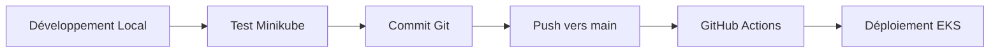

# Comparaison des Environnements de Déploiement

## Vue d'ensemble

Ce document compare les deux environnements de déploiement disponibles pour l'application msg-devops :

- **Minikube** : Environnement de développement local
- **AWS EKS** : Environnement de production cloud

---

## Tableau comparatif complet

| Critère | Minikube | AWS EKS |
|---------|----------|---------|
| **Environnement** | Local (machine de développement) | Cloud (AWS) |
| **Coût** | Gratuit | ~190 EUR/mois |
| **Durée d'installation** | ~5 minutes | ~20-30 minutes |
| **Commande de déploiement** | `sudo ./deploy-minikube-oneclick.sh` | `./deploy-eks-oneclick.sh` |
| **Sudo requis** | Oui | Non |
| **Système d'exploitation** | Linux uniquement | Linux uniquement |
| **Connexion Internet** | Requise | Requise |
| **Credentials** | Aucun | AWS Access Key + Secret |
| **Persistance des données** | Locale (PVC) | Locale (EBS) |
| **Scaling horizontal** | Limité (ressources locales) | Illimité (AWS Auto Scaling) |
| **Haute disponibilité** | Non | Oui (multi-AZ) |
| **Load Balancer** | Non (NodePort) | Oui (AWS ALB) |
| **Monitoring** | Dashboard Kubernetes | CloudWatch + Dashboard |
| **CI/CD** | Non intégré | GitHub Actions |
| **Accès externe** | IP Minikube + NodePort | URL publique LoadBalancer |
| **Sauvegarde** | Manuelle | AWS Backups |
| **SSL/TLS** | Non intégré | Configurable (ACM) |

---

## Comparaison technique détaillée

### Infrastructure

#### Minikube

| Composant | Configuration |
|-----------|---------------|
| Cluster | 1 node Docker |
| RAM | 4 GB (configurable) |
| CPUs | 2 (configurable) |
| Stockage | Disque local |
| Réseau | Bridge Docker |

#### EKS

| Composant | Configuration |
|-----------|---------------|
| Cluster | Kubernetes managé 1.28 |
| Nodes | 2x EC2 t3.medium (4 GB RAM, 2 vCPUs) |
| VPC | Subnets publics/privés, NAT Gateway |
| Stockage | EBS volumes |
| Réseau | VPC AWS avec Security Groups |

---

### Déploiements et services

#### Backend

| Aspect | Minikube | EKS |
|--------|----------|-----|
| Replicas | 1 (limitation SQLite) | 1 (limitation SQLite) |
| Image | Build local | ECR (push depuis local) |
| imagePullPolicy | Never | IfNotPresent |
| Service | NodePort (30500) | ClusterIP (5000) |
| Volume | PVC 500Mi | PVC 1Gi (EBS) |

#### Frontend

| Aspect | Minikube | EKS |
|--------|----------|-----|
| Replicas | 2 | 2 (scalable) |
| Image | Build local | ECR (push depuis local) |
| imagePullPolicy | Never | IfNotPresent |
| Service | NodePort (30080) | LoadBalancer (port 80) |
| Scaling | Non | Oui (HPA possible) |

---

### Gestion des images Docker

#### Minikube

```bash
# Build local dans le daemon Minikube
eval $(minikube docker-env)
docker build -t msg-devops-backend:latest .
docker build -t msg-devops-frontend:latest .

# imagePullPolicy: Never dans les manifests
# Pas de registry externe
```

#### EKS

```bash
# Build local puis push vers ECR
docker build -t msg-devops-backend:latest .
docker tag msg-devops-backend:latest $AWS_ACCOUNT_ID.dkr.ecr.eu-west-3.amazonaws.com/msg-devops-backend:latest
docker push $AWS_ACCOUNT_ID.dkr.ecr.eu-west-3.amazonaws.com/msg-devops-backend:latest

# Les pods pull depuis ECR
# Amazon ECR comme registry privé
```

**Note** : Aucun des deux environnements n'utilise Docker Hub.

---

## Cas d'usage recommandés

### Minikube

| Cas d'usage | Description |
|-------------|-------------|
| Développement local | Tester rapidement les modifications |
| Apprentissage Kubernetes | Apprendre sans coûts |
| Tests d'intégration | Valider avant production |
| Démos hors ligne | Présentation sans Internet |
| Prototypage rapide | Expérimentations |

**Avantages** :
- Gratuit
- Rapide à déployer
- Pas de credentials externes
- Contrôle total

**Inconvénients** :
- Pas de haute disponibilité
- Ressources limitées
- Pas de CI/CD intégré
- Pas d'accès public

### AWS EKS

| Cas d'usage | Description |
|-------------|-------------|
| Production | Application accessible publiquement |
| Staging | Environnement de pré-production |
| Tests de charge | Simuler le trafic réel |
| Démonstration publique | URL accessible depuis n'importe où |
| CI/CD | Déploiement automatisé |

**Avantages** :
- Haute disponibilité
- Scaling automatique
- Monitoring avancé
- CI/CD avec GitHub Actions
- Accès public

**Inconvénients** :
- Coût mensuel (~190 EUR)
- Configuration plus complexe
- Credentials AWS requis
- Temps de provisionnement plus long

---

## Workflow recommandé

### Développement classique



**Étapes** :
1. Développer localement
2. Tester sur Minikube : `sudo ./deploy-minikube-oneclick.sh`
3. Commiter les modifications
4. Pousser vers `main`
5. GitHub Actions déploie automatiquement sur EKS

### Tests rapides

```bash
# Développement avec hot-reload sur Minikube
sudo ./deploy-minikube-oneclick.sh

# Après modification du code
eval $(minikube docker-env)
cd backend && docker build -t msg-devops-backend:latest .
kubectl rollout restart deployment/backend

# Vérifier immédiatement
minikube service frontend --url
```

---

## Coûts détaillés

### Minikube : Gratuit

| Ressource | Coût |
|-----------|------|
| Cluster Kubernetes | 0 EUR |
| Stockage | 0 EUR (disque local) |
| Réseau | 0 EUR |
| **Total** | **0 EUR** |

**Coût caché** : Consommation électrique de votre machine (~1-2 EUR/mois)

### EKS : ~190 EUR/mois

| Ressource | Configuration | Coût mensuel (EUR) |
|-----------|---------------|-------------------|
| EKS Control Plane | Cluster managé | ~73 EUR |
| EC2 Instances | 2x t3.medium (730h) | ~60 EUR |
| NAT Gateway | 1 instance + data transfer | ~40 EUR |
| Application Load Balancer | ALB + règles | ~15 EUR |
| EBS Volumes | 2x 20 GB gp2 | ~4 EUR |
| Data Transfer | ~100 GB sortant | ~5 EUR |
| **Total estimé** | - | **~190 EUR** |

**Optimisations possibles** :
- Instances Spot : -70% sur EC2 (~18 EUR au lieu de 60 EUR)
- 1 seule instance t3.small : -50% (~30 EUR)
- Sans NAT Gateway (public subnet only) : -40 EUR
- **Total optimisé** : ~100-110 EUR/mois

**IMPORTANT** : Détruire après usage pour éviter les frais.

---

## Performances

### Temps de déploiement

| Étape | Minikube | EKS |
|-------|----------|-----|
| Installation des dépendances | 1-2 min | 2-3 min |
| Provisionnement infra | 1 min | 15-20 min |
| Build des images | 1-2 min | 1-2 min |
| Push vers registry | 0 min | 1-2 min |
| Déploiement K8s | 1 min | 2-3 min |
| **Total** | **~5 min** | **~20-30 min** |

### Temps de réponse

| Métrique | Minikube | EKS |
|----------|----------|-----|
| Latence API | <10 ms (local) | 20-50 ms (dépend de la localisation) |
| Disponibilité | Dépend de votre machine | 99.95% SLA (AWS) |
| Throughput | Limité par ressources locales | Scalable (jusqu'à milliers de req/s) |

---

## Sécurité

### Minikube

| Aspect | Description |
|--------|-------------|
| Exposition | Locale uniquement |
| Credentials | Aucun requis |
| HTTPS | Non configuré |
| Firewall | Firewall local |
| Isolation | Docker |

**Risques** : Faibles (accès local uniquement)

### EKS

| Aspect | Description |
|--------|-------------|
| Exposition | Publique (LoadBalancer) |
| Credentials | AWS Access Keys |
| HTTPS | Configurable (ACM) |
| Firewall | Security Groups AWS |
| Isolation | VPC + Subnets |

**Risques** : Modérés (exposition publique, credentials à protéger)

**Recommandations** :
- Ne jamais commiter les credentials AWS
- Utiliser des IAM roles restrictifs
- Configurer HTTPS avec ACM
- Activer les logs CloudTrail
- Rotation des Access Keys

---

## Monitoring et observabilité

### Minikube

| Outil | Disponibilité |
|-------|---------------|
| Dashboard K8s | Oui (`minikube dashboard`) |
| Metrics Server | Oui (addon) |
| Logs | `kubectl logs` |
| Events | `kubectl get events` |
| CloudWatch | Non |
| Prometheus | Configurable manuellement |

### EKS

| Outil | Disponibilité |
|-------|---------------|
| Dashboard K8s | Configurable |
| Metrics Server | Configurable |
| Logs | CloudWatch Logs (automatique) |
| Events | CloudWatch Events |
| CloudWatch | Oui (intégré) |
| Prometheus | Configurable |

---

## Maintenance

### Minikube

| Tâche | Fréquence | Commande |
|-------|-----------|----------|
| Mise à jour Minikube | Mensuelle | `sudo apt update && sudo apt upgrade minikube` |
| Mise à jour K8s | Version Minikube | Inclus dans Minikube |
| Nettoyage | Après tests | `minikube delete` |
| Backups | Manuel | Copier le PVC |

### EKS

| Tâche | Fréquence | Commande |
|-------|-----------|----------|
| Mise à jour EKS | Trimestrielle | Via Terraform |
| Mise à jour nodes | Mensuelle | Via Terraform |
| Nettoyage | Après projet | `./deploy-eks-oneclick.sh --destroy` |
| Backups | Automatique | AWS Backup (configurable) |

---

## Migration Minikube vers EKS

### Processus

```bash
# 1. Tester sur Minikube
sudo ./deploy-minikube-oneclick.sh

# 2. Vérifier que tout fonctionne
minikube service frontend --url

# 3. Commiter et pousher
git add .
git commit -m "Ready for production"
git push origin main

# 4. Configurer AWS credentials
export AWS_ACCESS_KEY_ID="..."
export AWS_SECRET_ACCESS_KEY="..."

# 5. Déployer sur EKS
./deploy-eks-oneclick.sh

# 6. Configurer GitHub Secrets pour CI/CD

# 7. Désormais : git push = déploiement auto
```

### Différences de configuration

| Fichier | Minikube | EKS |
|---------|----------|-----|
| Manifests | `k8s-minikube/*.yaml` | `k8s/*.yaml` |
| imagePullPolicy | Never | IfNotPresent |
| Image registry | Local | ECR |
| Service frontend | NodePort | LoadBalancer |
| PVC size | 500Mi | 1Gi |

---

## Décision rapide

### Choisir Minikube si :

- Développement local uniquement
- Pas de budget
- Tests et apprentissage
- Pas besoin d'accès public
- Ressources locales suffisantes

### Choisir EKS si :

- Application en production
- Besoin d'accès public
- Haute disponibilité requise
- CI/CD automatisé souhaité
- Budget disponible (~190 EUR/mois)
- Scaling important prévu

---

## Résumé en une phrase

| Environnement | Résumé |
|---------------|--------|
| **Minikube** | Développement local gratuit et rapide, idéal pour tester. |
| **EKS** | Production cloud payante avec haute disponibilité et CI/CD. |

---

## Documentation complémentaire

- **DEPLOYMENT_MINIKUBE.md** : Guide complet Minikube
- **DEPLOYMENT.md** : Guide complet EKS
- **ONECLICK_GUIDE.md** : Scripts automatisés
- **SYSTEM_REQUIREMENTS.md** : Prérequis système
- **SQLITE_NOTES.md** : Notes sur SQLite et scaling

---

**Version** : 1.0.0  
**Dernière mise à jour** : Décembre 2025