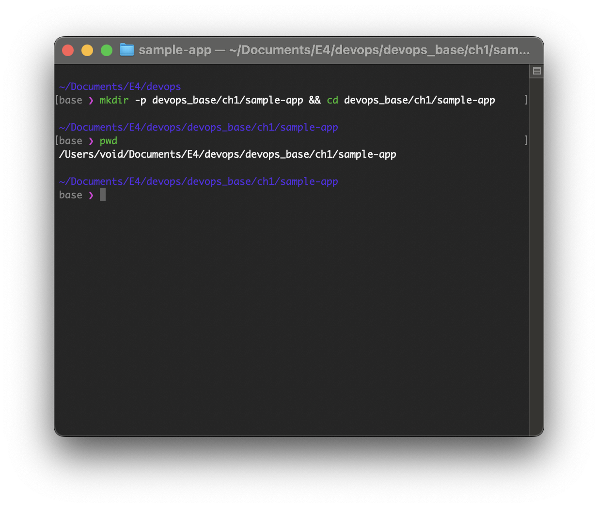
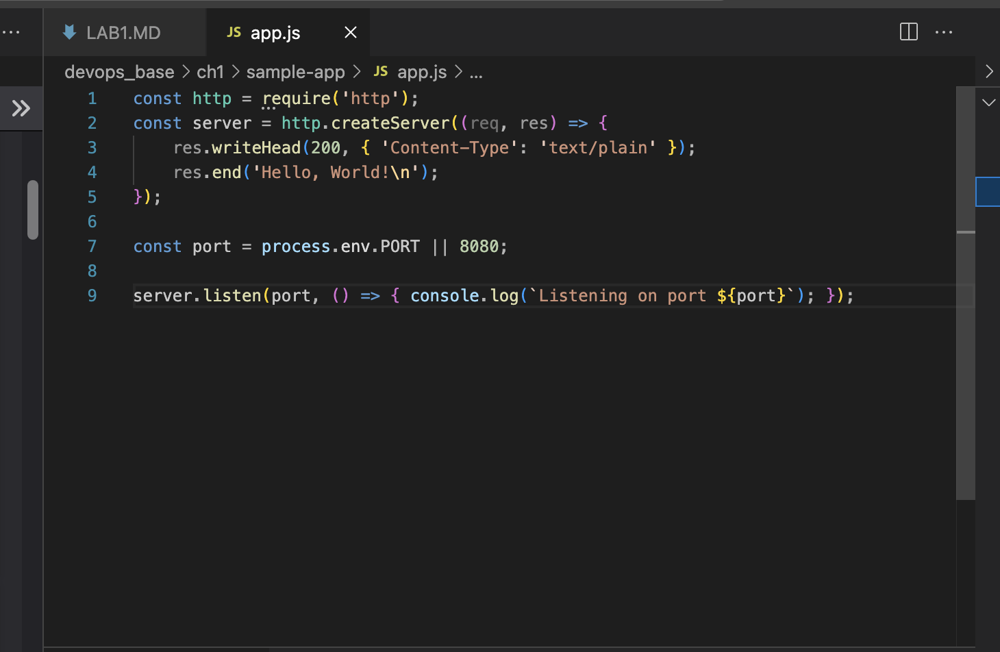
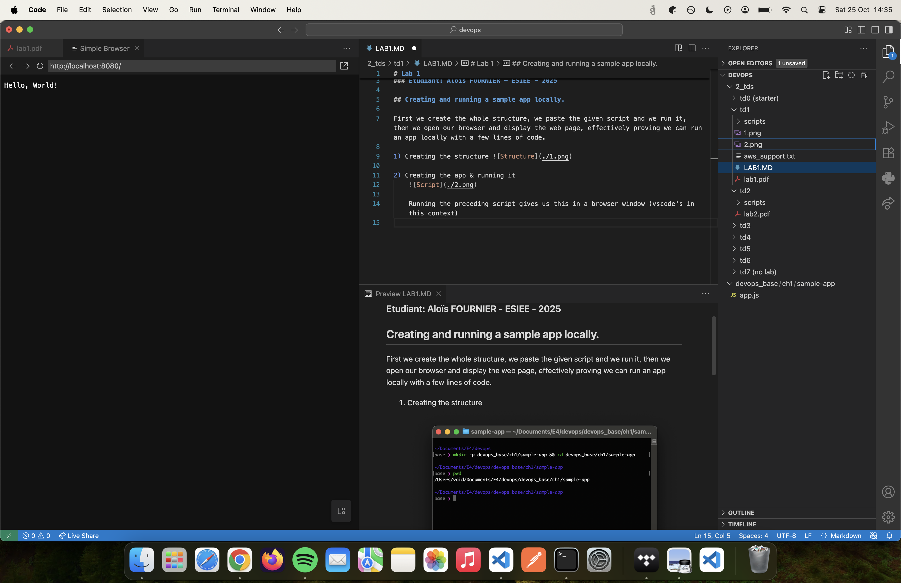
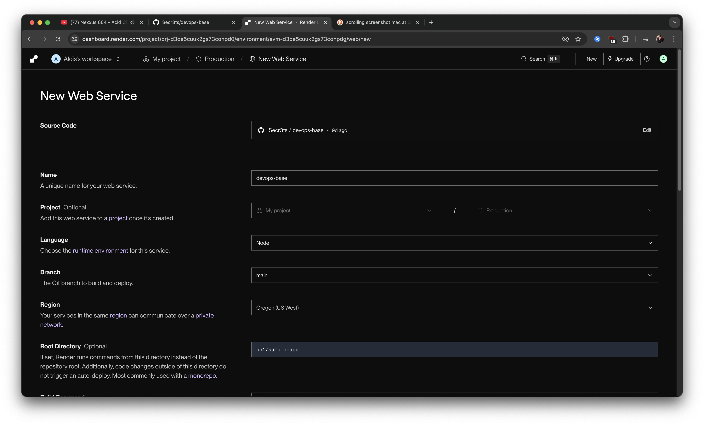
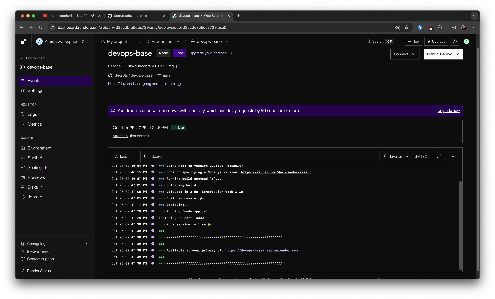
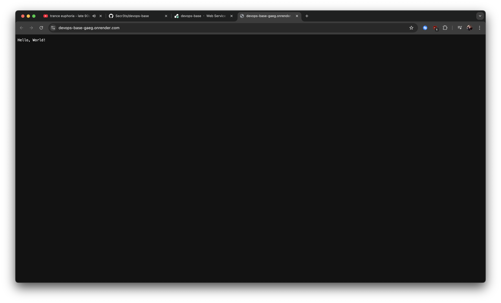
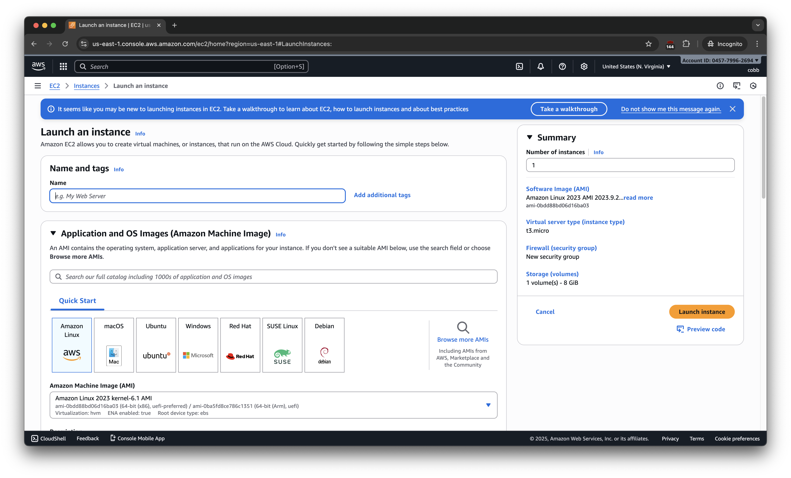

# Lab 1

### Etudiant: Aloïs FOURNIER - ESIEE - 2025

## Creating and running a sample app locally.

First we create the whole structure, we paste the given script and we run it, then we open our browser and display the web page, effectively proving we can run an app locally with a few lines of code.

1) Creating the structure 

2) Creating the app & running it
    

    Running the preceding script gives us this in a browser window (vscode's in this context)

    

## Running a sample app remotely on Render

I went to [Render](https://render.com) and created an account using my git credentials, then pushed the devops_base to this [url](https://github.com/Secr3ts/devops-base). 

1. Creation of the project on Render
    

    

    Note: the build command here is ':' which is the __null__  command in bash, it does nothing and returns nothing.

2. Running the project

    

    Once it finished loading, I followed the given url (which in my case was 'https://devops-base-gaeg.onrender.com') and got greeted by this:

    

## Running a sample app remotely on AWS

After creating the IAM user (named cobb for testing purposes) we launch an EC2 instance. 

Since i'm not eligible for the free tier, I can't proceed with the following instructions.