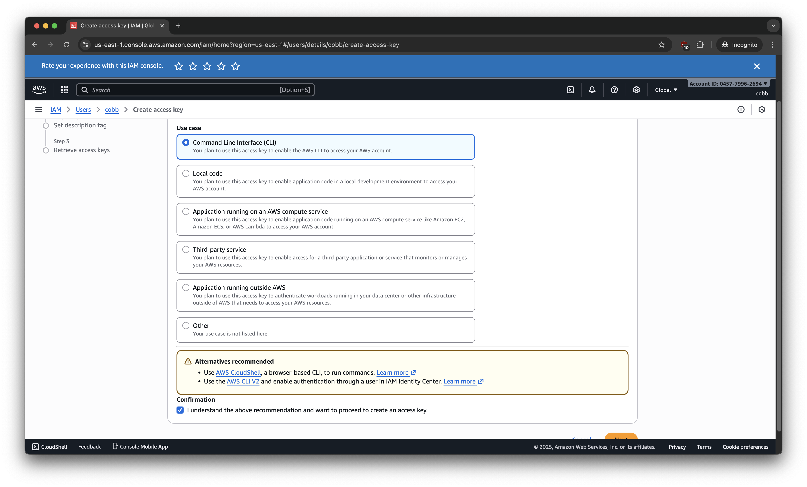
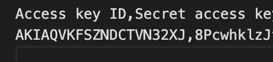
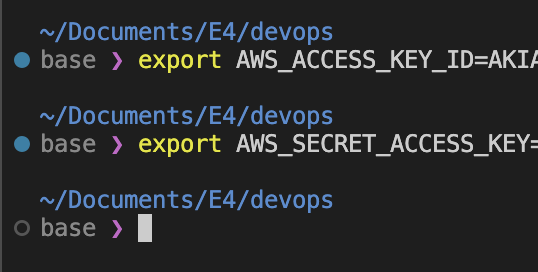

# Lab 2

### Etudiant: Aloïs FOURNIER - ESIEE - 2025

## Authenticating to AWS via CLI

We create the appropriate Security credentials for accessing AWS from the CLI.

We have now the resulting CSV 

we then copy and export those in the current ENV:

## Deployinh EC2 using bash script

After copying the scripts, I will not run it as I don't have the FREE TIER on AWS.