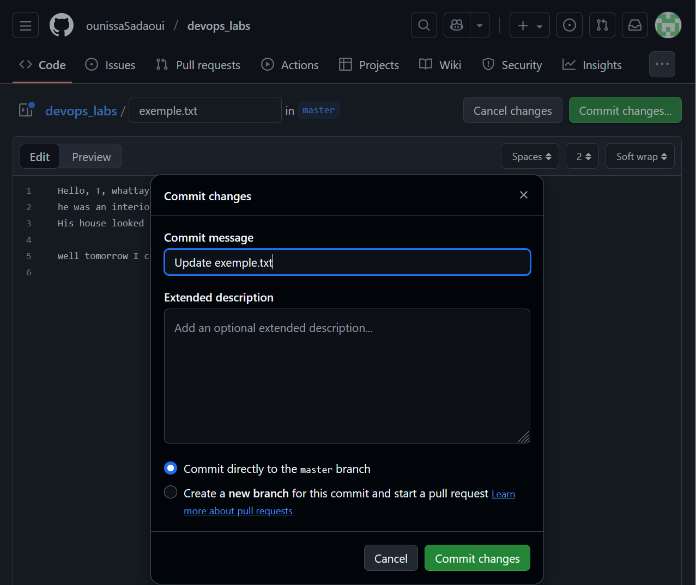
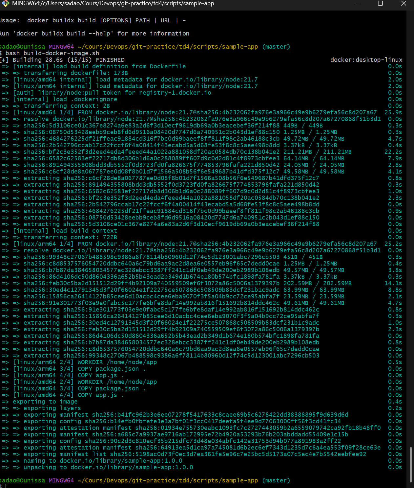
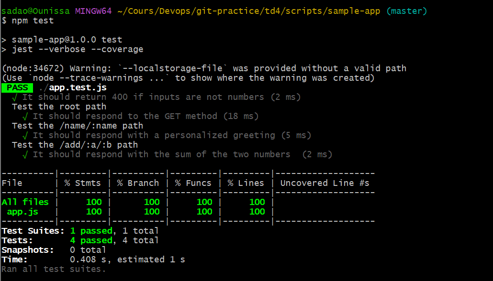
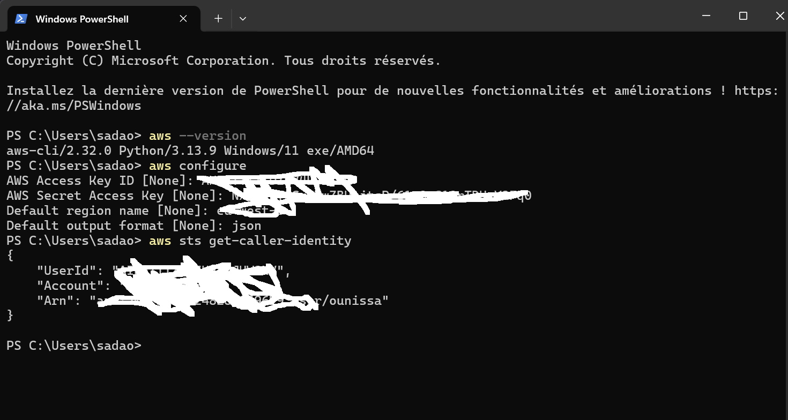
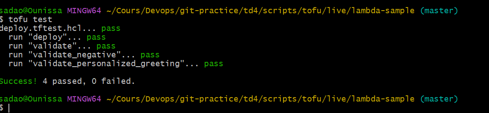

# TP 4 – DevOps  
*Compte rendu*

---

## Section 1 Git :

### Initialisation et premiers commits

```bash
git init
git status
git add .
git commit -m "Initial commit"
```

### Ajout d’un tag

```bash

git tag v1.0
git tag
```

### Passage sur une branche dédidée :

```bash 
git checkout feature-rebase
```

Différence entre merge et rebase :

merge conserve l’historique des branches et ajoute un commit de merge, ce qui peut produire un historique en zigzag.

rebase réécrit l’historique, ne crée pas de commit de merge et donne un historique linéaire, plus lisible.

### Création d'un dépotGitHub et push

```bash 
git remote add origin https://github.com/<user>/<repo>.git
git branch -M main
git push -u origin main
```

### Modification directe sur GitHub
Après modification du fichier sur GitHub, récupération côté local :

 ```bash 
git pull
git checkout feature-rebase
```
Une Pull Request est bien générée.

### Protection des branches

Pour imposer une validation des Pull Requests , Aller dans Settings, Puis Branches.
Sélectionner la branche concernée

Activer : 

*Require pull request reviews before merging

*Require status checks to pass before merging

### Docker 

#### Résultat après les étapes initiales :

*Importance du versionnage des images*

Utiliser une version spécifique permet :

*la reproductibilité

*une meilleure prévisibilité en production

*une facilité de debug


*Ajout dans le package.json :*

```bash
"docker-start": "docker run -p 8080:8080 sample-app:1.0.0"
```

*Création et lancement de l’image*

```bash
docker build -t sample-app:1.0.0 .
docker run -p 8080:8080 sample-app:1.0.0
```


### Npm et dépendances 

*dependencies : nécessaires au fonctionnement de l’application en production

*devDependencies : utilisées uniquement pour le développement (tests, lint, build…)

*Ajout d’une dépendance de développement :*

```bash
npm install <package-name> --save-dev
```

### Tests et qualité du code

#### Implémentation de l’endpoint /add/:a/:b

```js
describe('Test the /add/:a/:b path', () => {
  test('It should respond with the sum of the two numbers', async () => {
    const a = 5;
    const b = 2;
    const response = await request(app).get(`/add/${a}/${b}`);

    expect(response.statusCode).toBe(200);
    expect(response.text).toBe(`${a + b}`);
  });
});

test('It should return 400 if inputs are not numbers', async () => {
  const response = await request(app).get('/add/abc/5');

  expect(response.statusCode).toBe(400);
  expect(response.text).toBe('Invalid numbers');
});
```
*Tests avec couverture de code*

```bash
npm test -- --coverage
```


Un dossier coverage/ est généré, contenant une page HTML détaillant la couverture des tests.

*Avantages du coverage testing :*

*réduction des risques de régression
*meilleure visibilité sur le code non testé
*pratique essentielle en CI/CD et DevOps

### OpenTofu (Infrastructure as Code)

#### Configuration AWS

```bash
aws configure
```

s

*Commandes OpenTofu*

```bash
tofu init
tofu apply
tofu test
```



*Test négatif (endpoint inexistant)*

Pour garantir le retour 404, modification de index.js :
```js
exports.handler = async (event) => {
  if (event.path === "/hello") {
    return {
      statusCode: 200,
      body: "Hello, World!"
    };
  } else {
    return {
      statusCode: 404,
      body: "Not Found"
    };
  }
};
```
puis test :

```bash
tofu test
```

#### Exercice 13 – Endpoint Hello avec paramètre

Approche TDD

Le test est écrit en premier et échoue initialement.
```js
Implémentation finale
exports.handler = async (event) => {
  if (event.path === "/hello") {
    const name = event.queryStringParameters?.name || "World";
    return {
      statusCode: 200,
      body: `Hello, ${name}!`
    };
  } else {
    return {
      statusCode: 404,
      body: "Not Found"
    };
  }
};
```

  [Compte rendu Complet ](https://docs.google.com/document/d/1def6ma3r9nGUagWqA2wna2PuTErt_CZm9dnuYnVnryM/edit?tab=t.0)

  [GitHub - OunissaSadaoui - TD4](https://github.com/ounissaSadaoui/devops_labs)

