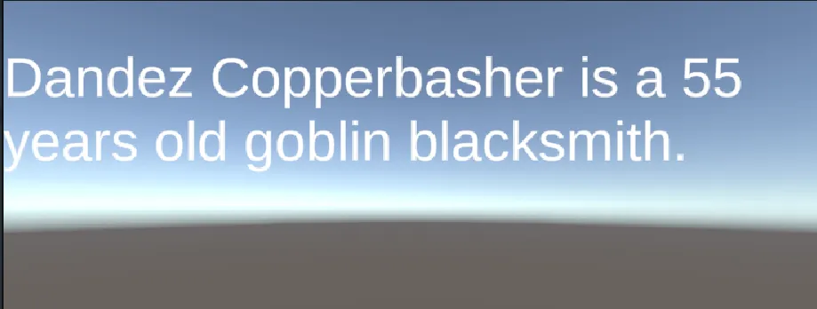
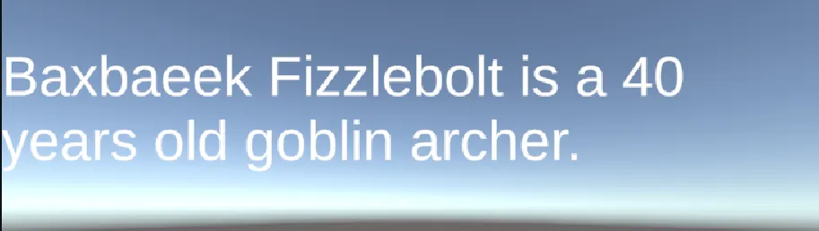

## Fonctionnement du générateur (`GoblinNameGenerator`)

Le script utilise des tableaux de syllabes pour générer des noms aléatoires de gobelins :

- `NameDatabase1`, `NameDatabase2`, `NameDatabase3` → parties du **prénom**
- `SurnameDatabase1`, `SurnameDatabase2` → parties du **nom de famille**

Une fonction aléatoire (`RandomInArray`) sélectionne un élément dans chaque tableau afin de former un **nom complet**.

---

## Propriétés principales du script `GoblinWriter`

1. `textMesh`  
   → Affiche le texte généré dans l’interface (UI **TextMeshPro**)

2. `goblinJobs`  
   → Liste des métiers possibles (ex. guerrier, archer, forgeron, chaman)

3. `goblinMaxAge`  
   → Âge maximal d’un gobelin (par défaut : **200 ans**)

---

## Fonctionnement

- Au démarrage du jeu ou lors de l’appui sur la touche **Espace**, la fonction `UpdateString()` est appelée.
- Cette fonction :
  - génère un **nom aléatoire** via `GoblinNameGenerator`,
  - choisit un **âge aléatoire** compris entre 20 et `goblinMaxAge`,
  - sélectionne un **métier aléatoire** dans `goblinJobs`,
  - affiche le résultat dans l’interface utilisateur.

### Exemple de sortie

> *“Fizdigex Boomblast is a 125 years old goblin warrior.”*

