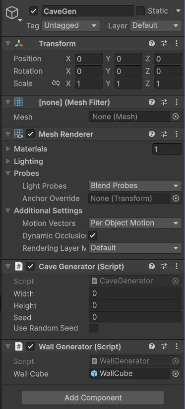
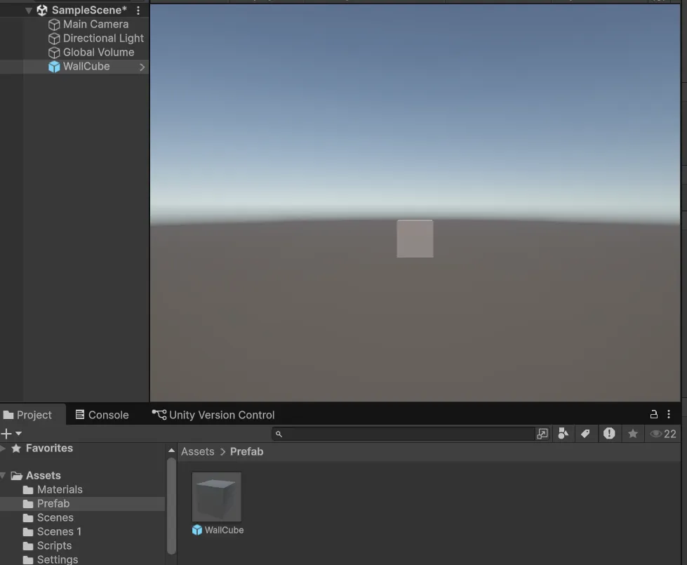
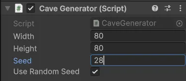
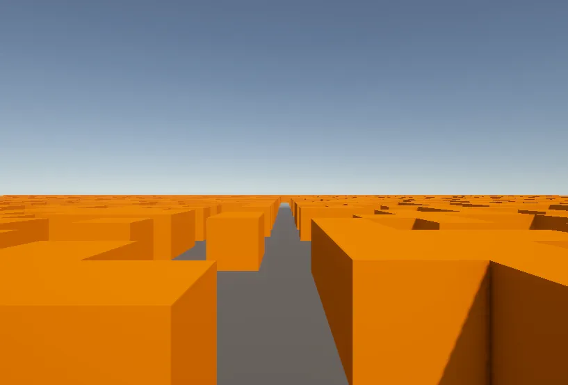
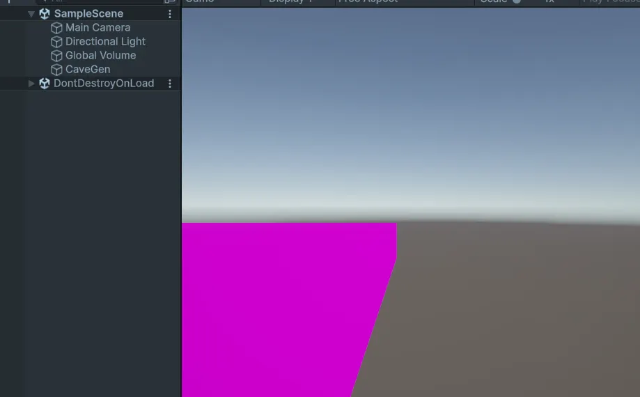
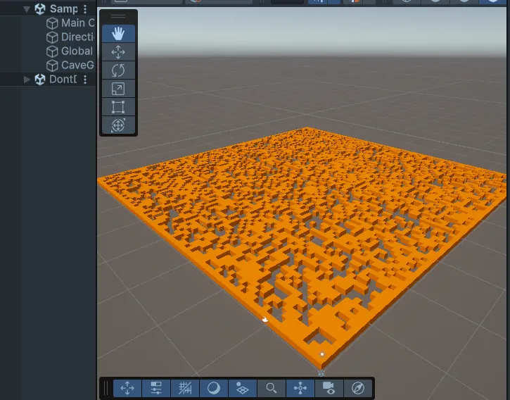

1. **Comprendre le principe général**
2. **Étape 1 : Création de la carte abstraite (InitializeRandomGrid)**
3. **Étape 2 : Compter les murs voisins**
4. **Étape 3 : Automate cellulaire (CellularAutomata)**
5. **Étape 4 : Interaction clavier**
6. **Étape 5 : Rendu simple avec WallGenerator**
7. **Étape 6 : Optimisation (MergeCubes)**
8. **Étape 7 : (optionnel) Marching Squares**

---

Le système repose sur deux composants principaux :

- **CaveGenerator** : responsable de la génération logique de la carte abstraite.
- **MeshGenerator** (et ses implémentations) : responsable du rendu 3D de cette carte.

La carte est représentée par une grille bidimensionnelle où chaque cellule correspond soit à un mur, soit à un espace vide.

## 1. Création **de la carte abstraite (InitializeRandomGrid)**

La fonction InitializeRandomGrid() initialise une carte 2D de dimensions paramétrables.

Principes mis en œuvre :

- Création d’une **bordure de murs** afin d’empêcher la grotte de s’ouvrir sur l’extérieur.
- Génération aléatoire contrôlée par une **graine (seed)**, permettant la reproductibilité.
- Création d’un **couloir central vide** garantissant une connectivité minimale de la grotte.

## **2. Compter les murs voisins**

Deux fonctions utilitaires sont utilisées :

- isWall(int c, int r) qui détermine si une cellule est un mur ou si elle est hors de la carte (considérée comme mur).
- GetSurroundingWallCount(int c, int r, int size) qui compte le nombre de murs autour d’une cellule dans un rayon donné.

## 3. **Automate cellulaire (CellularAutomata)**

La fonction CellularAutomata(bool clean) applique les règles d’évolution à la carte.

Deux ensembles de règles sont implémentés :

- Mode normal : structure les grottes et remplit les zones trop vides.
- Mode clean : affine la carte en supprimant les grands espaces ouverts.

Après plusieurs itérations, la carte converge vers une structure de grotte stable et cohérente.

## 4. Interaction utilisateur

La fonction Update() permet d’interagir avec le générateur en temps réel :

- N : génération d’une nouvelle carte aléatoire.
- G : application de l’automate cellulaire standard.
- Espace : application de l’automate en mode nettoyage.

## 5. **Rendu simple avec WallGenerator**

Le rendu est assuré par la classe WallGenerator, qui hérite de MeshGenerator.

Principe :

- Chaque cellule mur (1) est représentée par un cube 3D.
- Les cubes sont instanciés à partir d’un prefab.



- La grotte est centrée dans la scène pour une meilleure visualisation.
    
   
    
    
    
    
    

## **6. Optimisation (MergeCubes) + correction du problème de matériau (modification finale)**

### Problème identifié:

La création de milliers de cubes entraîne une forte baisse de performances, Unity n’étant pas optimisé pour gérer un grand nombre de GameObjects.

### Solution mise en œuvre:

La fonction MergeCubes() fusionne tous les cubes générés en un seul mesh à l’aide de CombineMeshes.

Avantages :

- Réduction drastique du nombre de GameObjects.
- Amélioration significative des performances.
- Rendu plus efficace pour de grandes cartes.

Après la fusion des meshes, la grotte apparaissait en rose (magenta), indiquant l’absence ou l’incompatibilité du matériau.

### Cause

Lors de la fusion :

- Les cubes porteurs du matériau sont détruits.
- Le mesh final est rendu par le MeshRenderer de l’objet principal (CaveGen).
- Aucun matériau n’était assigné explicitement à cet objet.

### Modification apportée

Un champ wallMaterial a été ajouté à WallGenerator, et ce matériau est assigné au MeshRenderer de l’objet principal avant la fusion des meshes.





```jsx
using System.Collections;
using System.Collections.Generic;
using UnityEngine;

public class WallGenerator : MeshGenerator
{

    public GameObject wallCube;
    public Material wallMaterial;

    public override void GenerateMesh(int[,] map, float squareSize)
    {

        foreach (Transform t in transform)
        {
            Destroy(t.gameObject);
        }

        int width = map.GetLength(0);
        int height = map.GetLength(1);

        for (int c = 0; c < width; c++)
        {
            for (int r = 0; r < height; r++)
            {

                if (map[c, r] == 1)
                {
                    GameObject obj = Instantiate(
                        wallCube,
                        new Vector3(c * squareSize, 0, r * squareSize),
                        Quaternion.identity
                    );
                    obj.transform.parent = transform;
                }
            }
        }

        transform.position = new Vector3(
            -width / 2.0f, 0, -height / 2.0f
        );

        GetComponent<MeshRenderer>().material = wallMaterial;

        MergeCubes();
    }

    private void MergeCubes() {
        transform.GetComponent<MeshFilter>().mesh = new Mesh();
        MeshFilter[] meshFilters = GetComponentsInChildren<MeshFilter>();
        CombineInstance[] combine = new CombineInstance[meshFilters.Length];

        int i = 0;
        while (i < meshFilters.Length) {
            combine[i].mesh = meshFilters[i].sharedMesh;
            combine[i].transform = meshFilters[i].transform.localToWorldMatrix;
            meshFilters[i].gameObject.SetActive(false);

            i++;
        }
        transform.GetComponent<MeshFilter>().mesh = new Mesh();
        transform.GetComponent<MeshFilter>().mesh.indexFormat = UnityEngine.Rendering.IndexFormat.UInt32;
        transform.GetComponent<MeshFilter>().mesh.CombineMeshes(combine, true);
        transform.gameObject.SetActive(true);
        foreach (Transform t in transform) {
            Destroy(t.gameObject);
        }
    }

}

```

---

Ce TD met en évidence la puissance de la génération procédurale à l’aide d’automates cellulaires.
La séparation entre logique de génération et rendu permet une grande flexibilité, tandis que l’optimisation par fusion de meshes assure des performances adaptées à un usage en temps réel dans Unity.