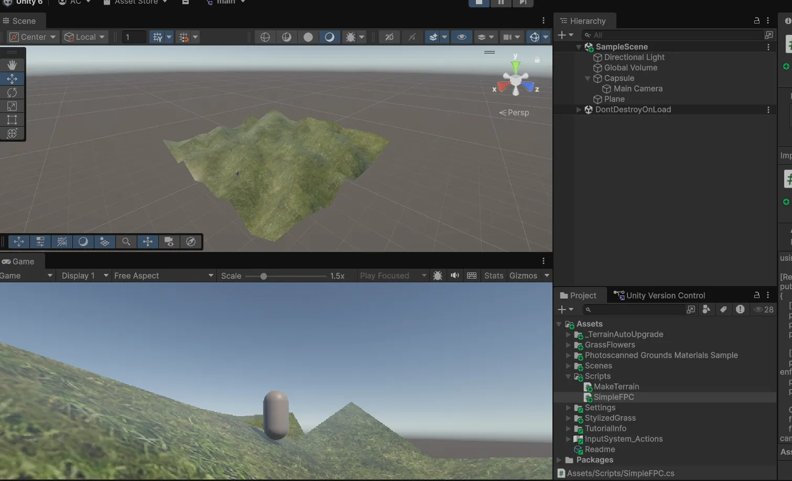
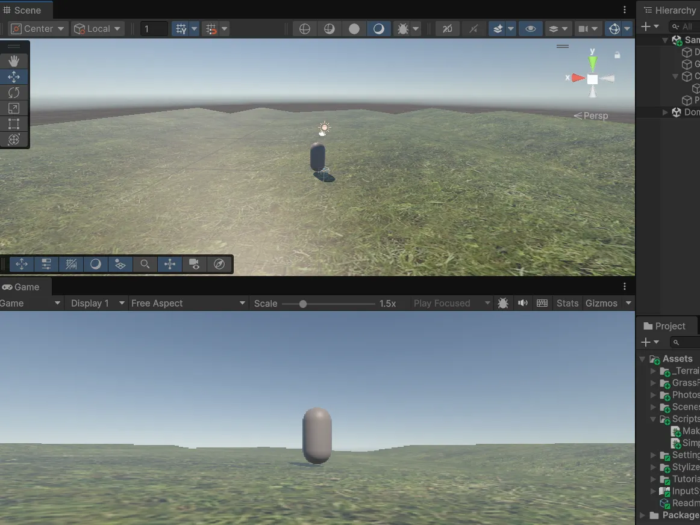
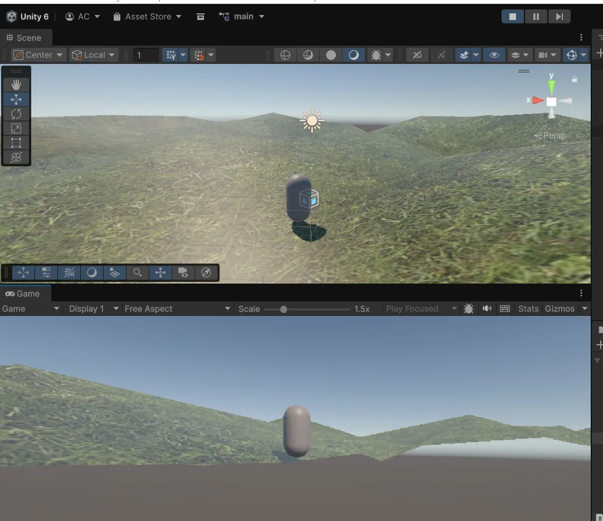
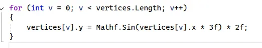
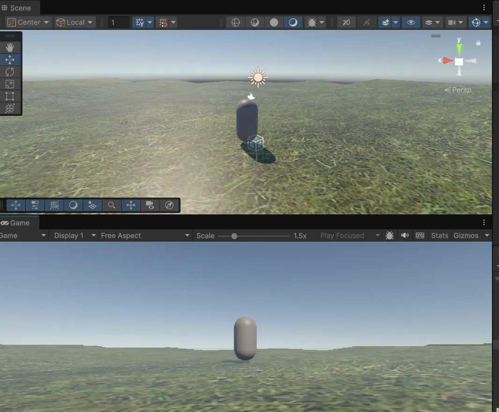

-Ajout du script MakeTerrain.cs au plane : 

Hauteurs aléatoires à la surface du terrain 



(génération d’un script simple pour le FPC avec chat gpt) 

-Modification du script MakeTerrain.cs pour utiliser une fonction sinusoidale pour un rendu plus lisse (trop uniforme pas assez naturel)



-Modification du script MakeTerrain.cs pour utiliser le bruit de Perlin 



---

**Réponses aux questions** 

**1 - Génération procédurale d’un terrain**

Théorique :
Expliquez le principe de la génération procédurale de terrains dans les environnements 3D.
Comment les algorithmes de génération procédurale contribuent-ils à la diversité et à
l'immersion des mondes virtuels ?

La génération procédurale de terrains (ou d’un contenu de manière générale) consiste à créer lesterrains de manière automatique plutôt que de le modéliser manuellement. Et pour cela on utilise des algorithmes mathématiques (aléatoire, sinusoidale, bruit de Perlin). 

Ces algorithmes de génération contribuent à la diversité et à l’immersion des mondes virtuels en créant des variétés et une continuité visuelle au niveau des formes du relief, ce qui rend les contenus plus naturels et moins répétitifs.  

Pratique :
Développez un script simple en utilisant Unity pour générer un terrain procédural basique.
Quelles techniques utilisez-vous pour assurer que chaque génération de terrain reste jouable
et visuellement cohérente ?



Dans ce script j’utilise un relief doux avec la fonction sinusoidale 



**2 - Application du bruit de Perlin dans la génération procédurale d'un terrain**

Théorique :
Comment le bruit de Perlin est-il appliqué dans la génération procédurale de terrains, et
quels sont les avantages de cette méthode par rapport aux méthodes traditionnelles de
génération de terrains ?

Le bruit de Perlin est une fonction pseudo-aléatoire qui utilise des gradients lisses entre les points à la surface du terrain. Ainsi deux points proches ont des valeurs proches contrairement à une fonction aléatoire où les valeurs peuvent passer de 0 à 50 pour des points très proches. 

Pratique :
Implémentez une fonction en C# pour Unity qui génère un terrain en utilisant le bruit de
Perlin. Comment ajustez-vous les paramètres du bruit de Perlin (comme l'amplitude, la
fréquence, et le nombre d'octaves) pour créer différents types de paysages (montagneux,
vallonnés, plats) ?

```csharp
void GeneratePerlinTerrain(
    MeshFilter mf,
    float amplitude = 8f,
    float scale = 5f,
    float H = 0.5f,         // "roughness" (persistence exponent)
    float lacunarity = 2f,
    float octaves = 4f,
    Vector2 offset = default
)
{
    Mesh mesh = mf.mesh;
    Vector3[] verts = mesh.vertices;
    Bounds b = mesh.bounds;
    float w = Mathf.Max(b.size.x, 1e-6f);
    float d = Mathf.Max(b.size.z, 1e-6f);

    var perlin = new Perlin();                           
    var fractal = new FractalNoise(H, lacunarity, octaves, perlin);

    for (int i = 0; i < verts.Length; i++)
    {
        float u = (verts[i].x - b.min.x) / w;            // 0..1
        float v = (verts[i].z - b.min.z) / d;            // 0..1

        float n = fractal.BrownianMotion(u * scale + offset.x, v * scale + offset.y);
        verts[i].y = n * amplitude;                       // hauteur finale
    }

    mesh.vertices = verts;
    mesh.RecalculateBounds();
    mesh.RecalculateNormals();
}

```

Ajustements des paramètres :

-Amplitude : contrôle la hauteur du relief donc petite pour des paysages plats et grandes pour des montagnes 

-Fréquence : contrôle la taille des reliefs donc faible pour des collines larges et élevée pour des reliefs sérrés 

-Nombre d’octaves : ajoute du détails donc peu pour des terrains et beaucoup pour des reliefs plus complexes

**3 - Intérêt de la génération procédurale d’un terrain**

Théorique :
Quels sont les principaux avantages de la génération procédurale de terrains dans le
développement de jeux vidéo et la simulation environnementale ?
Pratique :

-Gain de temps : Plus besoin de modéliser chaque contenu manuellement 

-Chaque exécution peut produire un monde différent 

-Économie d’espace car on ne stocke tous les modèles complets mais juste les règles pour qu’ils varient à chaque fois et on peut en générer à l’infini 

-Et enfin on peut ajuster dynamiquement le terrain selon le gameplay (villes, routes, météo etc)

Proposez une méthode pour intégrer la génération procédurale de terrains dans un projet
existant afin d'améliorer l'expérience de jeu sans augmenter significativement les besoins en
ressources. Quelles seraient les étapes et les considérations clés ?

Par exemple dans notre jeu “The missing ones”pour intégrer la génération procédurale de terrains, on peut générer automatiquement le sol et le relief de la ville avec du bruit de Perlin, afin de créer des rues et des zones légèrement variées sans tout modéliser à la main. Le reste des éléments peuvent rester fixes pour garder notre scénario et ainsi ajouter de la diversité visuelle sans surcoût. 

**4- Gain de temps**

Théorique :
En quoi la génération procédurale de terrains peut-elle être considérée comme avantageuse
en termes de temps de développement et de coûts par rapport à la modélisation manuelle
des terrains ?

La génération procédurale permet de produire automatiquement une multitude de contenus en quelques secondes sans les modéliser un à un ce qui peut durer plusieurs jours.

Le coût humain et le temps de création sont ainsi réduits.  
Pratique :
Évaluez le temps nécessaire pour créer un terrain avec une méthode procédurale contre une
méthode de modélisation manuelle pour un projet de jeu spécifique. Quels critères
utiliseriez-vous pour cette évaluation ?

La méthode procédurale peut durer quelques minutes et la méthode peut durer des jours.

Les critères : 

-Choix de la texture pour le terrain : peut avoir la même durée pour les deux méthodes 

-Choix de l’algorithme de génération : peut durer quelques minutes

-Développement du script qui intègre la fonction de génération choisie : peut aller de quelques minutes à des heures en fonctions de nos compétences techniques dans le développement de scripts  

-Création des reliefs manuellement : Cette étape peut durer des heures en fonctions de la qualité visuelle que l’on veut obtenir et ensuite il faudra refaire la même chose pour chaque terrain.