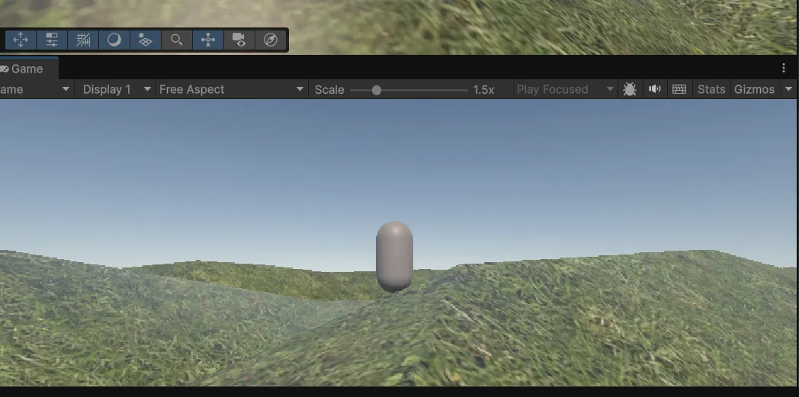
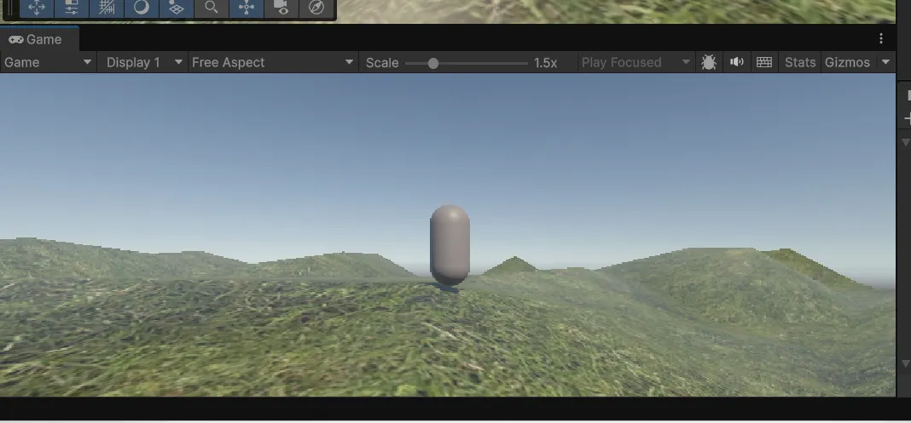
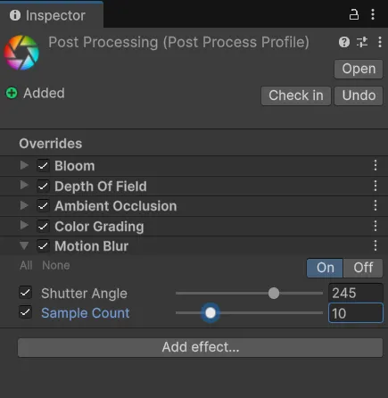

## Post-processing – Unity

### Avant post-processing



---

### Après ajout du post-processing


---

### Ajustements réalisés



---

## Réponses aux questions

### 1 – Compréhension des fondamentaux

**Décrivez le rôle et l'importance des effets de post-traitement dans la création d'expériences visuelles immersives dans Unity. Comment ces effets peuvent-ils influencer la perception du joueur ?**

Les effets de post-traitement améliorent la qualité visuelle d’une scène après son rendu par la caméra.  
Ils renforcent le réalisme global du jeu et permettent de créer une ambiance visuelle cohérente avec l’intention artistique.

Par exemple, l’utilisation de filtres de couleur chaude peut rendre l’atmosphère plus apaisante, tandis que des teintes froides peuvent créer une ambiance plus inquiétante.  
Ces effets renforcent l’immersion du joueur et influencent directement l’émotion ressentie.

---

### 2 – Gestion des ressources

**Les effets de post-traitement peuvent avoir un impact significatif sur les performances.  
Quelles sont les bonnes pratiques pour optimiser leur utilisation, notamment pour les plateformes mobiles récentes ?**

Pour limiter l’impact des effets de post-processing sur les performances :
- n’activer que les effets réellement pertinents pour la scène,
- réduire la qualité ou la précision de certains effets (paramètres en *Low*),
- privilégier l’utilisation d’un **Post-Process Volume global** plutôt que plusieurs volumes locaux,
- adapter les effets selon la plateforme cible.

---

### 3 – Application pratique spécifique

**Expliquez comment configurer un effet de flou de mouvement (Motion Blur) dans Unity et son impact sur le réalisme d’une scène dynamique.**



L’effet de **Motion Blur** est configuré via un Post-Process Volume en activant le composant correspondant.

Cet effet donne l’impression que les mouvements sont plus rapides et plus fluides.  
Il rend la scène plus cinématique et améliore le ressenti de vitesse lors des déplacements rapides ou des actions intenses.

---

### 4 – Intégration avancée

**Comment intégrer un système de post-traitement qui s’adapte dynamiquement aux conditions environnementales du jeu ?**

Pour adapter dynamiquement les effets de post-processing, on peut créer plusieurs **profils de post-processing** et les activer en fonction de la zone ou de la situation.

Par exemple, lors du passage d’un personnage d’un environnement lumineux vers une zone sombre, un script peut changer le profil actif :

```csharp
if (InDarkZone)
    volume.profile = darkProfile;
else
    volume.profile = dayProfile;
```

Dans ces profils, on peut ajuster des paramètres comme la **température de couleur**, l’**Ambient Occlusion**, l’exposition ou le contraste afin de renforcer l’ambiance visuelle.

---

### 5 – Nouveautés et tendances

**Quel effet de post-traitement vous semble particulièrement prometteur pour l’avenir des jeux Unity ?**

L’effet de **vignette** est particulièrement intéressant.  
Il assombrit légèrement les bords de l’écran tout en gardant le centre plus lumineux, ce qui dirige naturellement le regard du joueur vers l’action principale.

Utilisé avec subtilité, il peut accentuer la tension lors d’une enquête ou renforcer le réalisme d’un moment dramatique.  
De plus, cet effet est léger à calculer et reste compatible avec la majorité des plateformes, y compris les plateformes mobiles.
