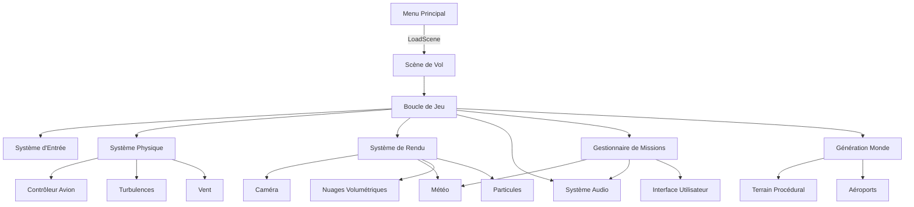
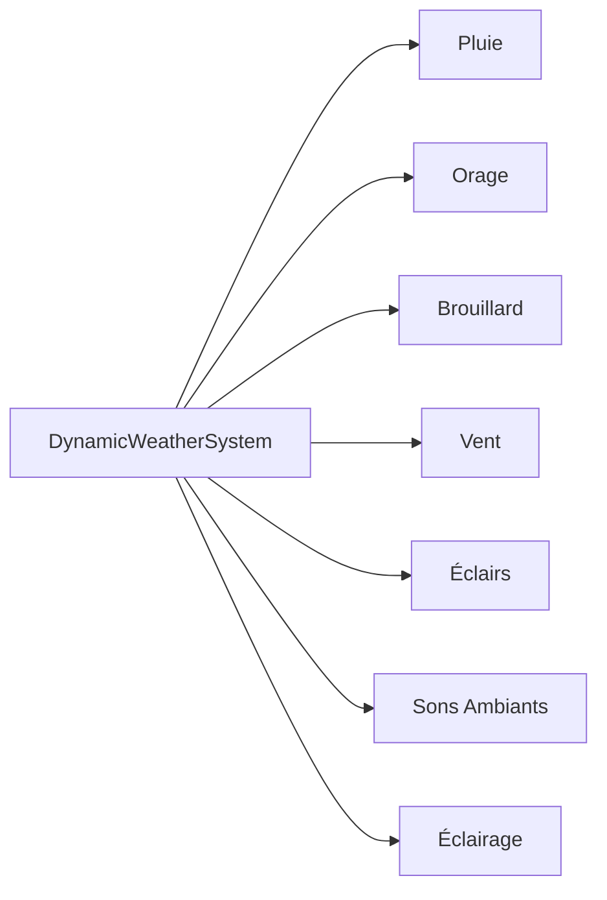
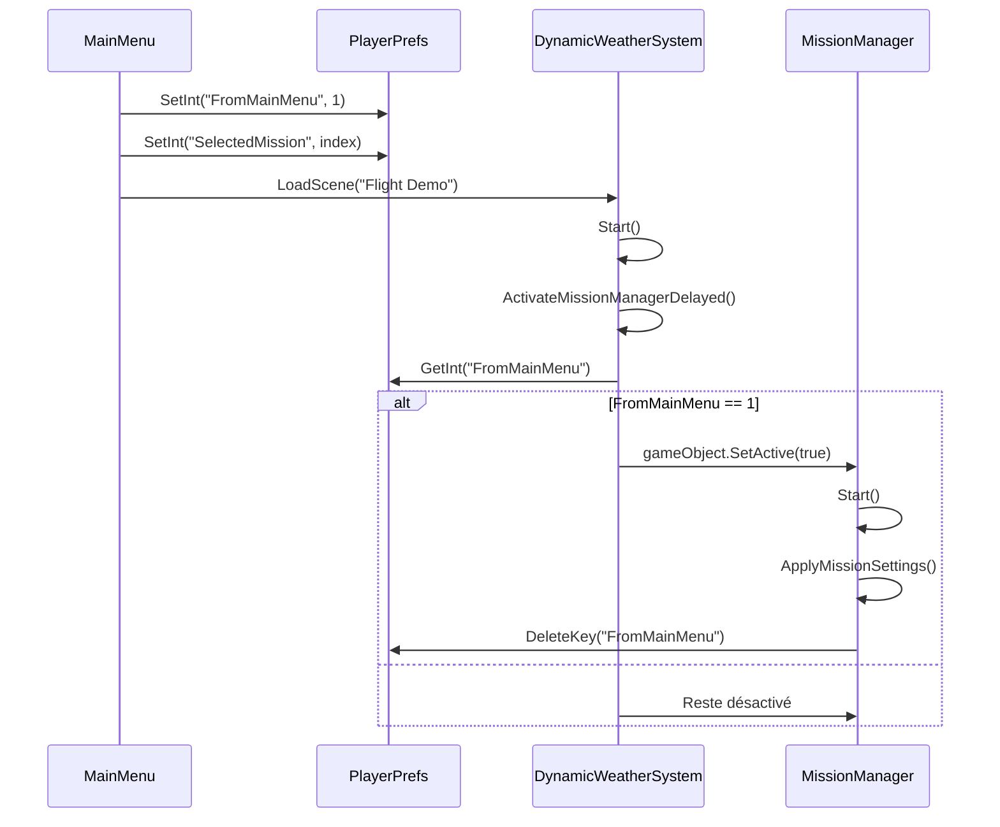
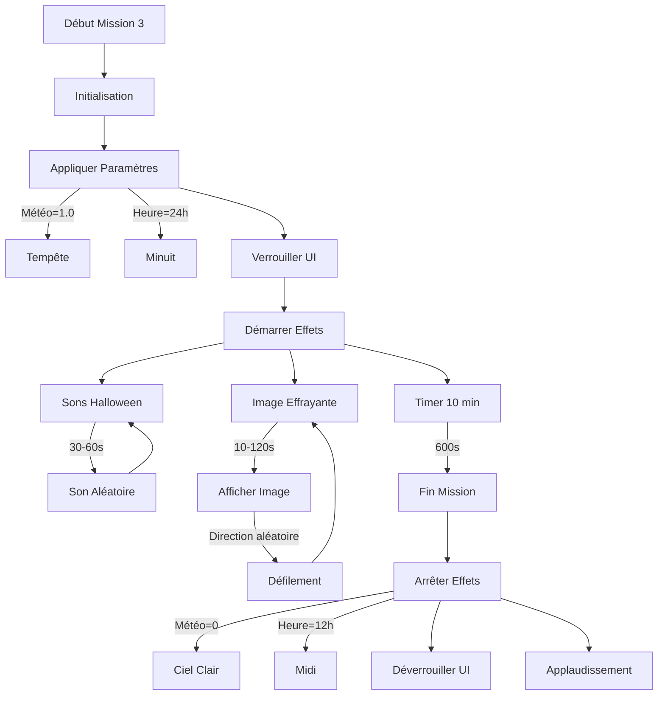
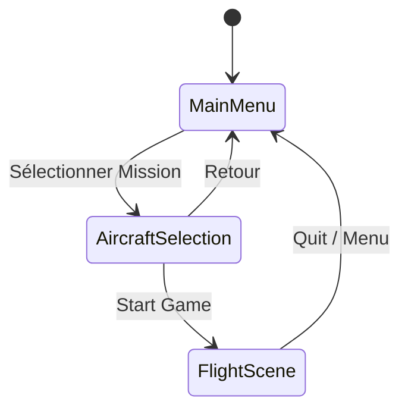
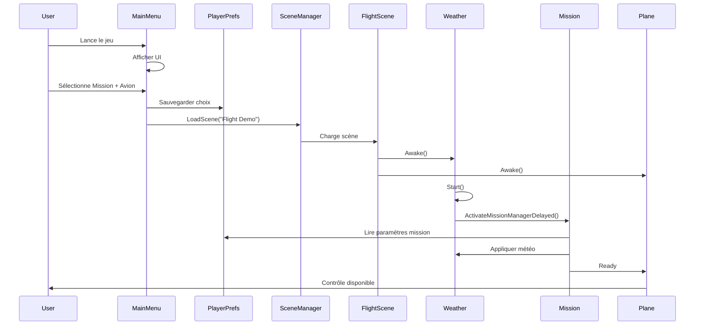
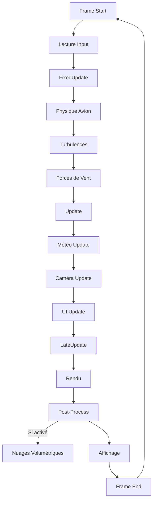
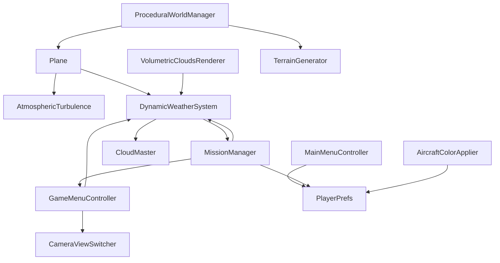

# Architecture Technique - Tiny Flight Simulator

## Table des matières

1. [Vue d'ensemble architecturale](#vue-densemble-architecturale)
2. [Architecture logicielle](#architecture-logicielle)
3. [Composants principaux](#composants-principaux)
4. [Flux de données](#flux-de-données)
5. [Gestion de la mémoire](#gestion-de-la-mémoire)
6. [Performance et optimisation](#performance-et-optimisation)

## Vue d'ensemble architecturale

### Principes de conception

Le projet suit une architecture modulaire basée sur les principes suivants:

- **Séparation des responsabilités** - Chaque système est autonome
- **Couplage faible** - Communication via interfaces et événements
- **Cohésion élevée** - Fonctionnalités regroupées logiquement
- **Extensibilité** - Facilité d'ajout de nouvelles fonctionnalités

### Diagramme d'architecture global




## Architecture logicielle

### Organisation des couches

```
┌─────────────────────────────────────────┐
│         Couche Présentation             │
│    (UI, Menu, HUD, Rendering)           │
└─────────────────────────────────────────┘
              ↕
┌─────────────────────────────────────────┐
│         Couche Métier                   │
│  (MissionManager, GameLogic, AI)        │
└─────────────────────────────────────────┘
              ↕
┌─────────────────────────────────────────┐
│         Couche Services                 │
│  (Weather, Audio, Input, Persistence)   │
└─────────────────────────────────────────┘
              ↕
┌─────────────────────────────────────────┐
│         Couche Noyau                    │
│  (Physics, Rendering, Unity Core)       │
└─────────────────────────────────────────┘
```

### Structure des dossiers

```
Assets/
├── _Scenes/                      # Scènes Unity
│   ├── MainMenu.unity
│   └── Flight Demo.unity
│
├── Scripts/
│   ├── Core/                    # Systèmes fondamentaux
│   │   ├── GameManager.cs
│   │   ├── SceneLoader.cs
│   │   └── PlayerPrefsManager.cs
│   │
│   ├── Aircraft/                # Systèmes liés à l'avion
│   │   ├── Plane.cs
│   │   ├── AircraftColorApplier.cs
│   │   └── PlaneGroundStability.cs
│   │
│   ├── Weather/                 # Système météorologique
│   │   ├── DynamicWeatherSystem.cs
│   │   ├── AtmosphericTurbulence.cs
│   │   └── CloudMaster.cs
│   │
│   ├── Mission/                 # Gestion des missions
│   │   └── MissionManager.cs
│   │
│   ├── World/                   # Génération procédurale
│   │   ├── ProceduralWorldManager.cs
│   │   ├── TerrainGenerator.cs
│   │   └── AirportGenerator.cs
│   │
│   ├── UI/                      # Interface utilisateur
│   │   ├── MainMenuController.cs
│   │   ├── GameMenuController.cs
│   │   ├── AircraftSelectionUI.cs
│   │   └── MissionSelectionUI.cs
│   │
│   ├── Camera/                  # Système de caméra
│   │   └── CameraViewSwitcher.cs
│   │
│   ├── Rendering/              # Rendu avancé
│   │   └── VolumetricCloudsRenderer.cs
│   │
│   └── 3rd Party/              # Bibliothèques externes
│       ├── MouseFlight/
│       └── MeshSimplifier/
│
├── Shaders/                    # Shaders personnalisés
│   └── VolumetricClouds.shader
│
├── Materials/                  # Matériaux
├── Models/                     # Modèles 3D
├── Resources/                  # Ressources chargées dynamiquement
└── Prefabs/                   # Préfabriqués Unity
```

## Composants principaux

### 1. Système de vol (Aircraft)

#### Plane.cs
Contrôleur principal de l'avion avec physique réaliste.

**Responsabilités**:
- Calcul des forces aérodynamiques (portance, traînée)
- Gestion du décrochage
- Effets de sol
- Intégration avec le Rigidbody

**Dépendances**:
- `Rigidbody` (Unity Physics)
- `AtmosphericTurbulence`
- `DynamicWeatherSystem` (pour le vent)

**Paramètres clés**:
```csharp
public float liftForce = 5000f;          // Force de portance
public float dragCoefficient = 0.02f;    // Coefficient de traînée
public float stallAngle = 15f;           // Angle de décrochage
public float takeoffMinSpeed = 30f;      // Vitesse minimale de décollage
```

**À vérifier**: Valeurs exactes des paramètres de vol qui peuvent varié selon le besoin

#### PlaneGroundStability.cs
Gère la stabilité de l'avion au sol.

**Fonctionnalités**:
- Capture de l'assiette initiale
- Stabilisation au sol
- Prévention du basculement

**Approche technique**:
- Utilise la réflexion pour accéder aux champs privés
- Recapture le pitch après placement
- Coroutine de réactivation du Rigidbody

```csharp
IEnumerator RecapturePitchAfterPlacement()
{
    yield return new WaitForFixedUpdate();
    yield return new WaitForFixedUpdate();
    
    // Réinitialiser le flag via réflexion
    var field = planeGroundStability.GetType()
        .GetField("initialPitchCaptured", BindingFlags.NonPublic | BindingFlags.Instance);
    field.SetValue(planeGroundStability, false);
}
```

### 2. Système météorologique (Weather)

#### DynamicWeatherSystem.cs
Système central de gestion de la météo.

**Architecture**:


**États gérés**:
| Paramètre | Type | Plage | Description |
|-----------|------|-------|-------------|
| `weatherIntensity` | float | 0.0 - 1.0 | Intensité globale (0=beau, 1=tempête) |
| `windDirection` | float | 0 - 360° | Direction du vent |
| `fogDistance` | float | 200 - 2000m | Distance de brouillard |
| `sunIntensity` | float | 0.0 - 3.0 | Intensité de la lumière |

**Systèmes de particules**:
- **Pluie**: Suit la caméra avec offset vertical de +50m
- **Orage**: Émission sporadique liée à l'intensité

**Méthode de mise à jour dynamique**:
```csharp
void UpdateWeather()
{
    // Vérifier la référence caméra à chaque frame
    if (mainCamera == null || !mainCamera.enabled)
    {
        mainCamera = Camera.main;
    }
    
    // Repositionner la pluie
    if (rainParticles != null && mainCamera != null)
    {
        rainParticles.transform.position = 
            mainCamera.transform.position + Vector3.up * 50f;
    }
    
    // Ajuster l'émission
    float emissionRate = Mathf.Lerp(0f, maxRainEmission, weatherIntensity);
    rainEmission.rateOverTime = emissionRate;
}
```

#### AtmosphericTurbulence.cs
Simule les turbulences atmosphériques.

**Modèle physique**:
- Turbulences basées sur l'altitude et la densité de l'air
- Variations aléatoires de direction et d'intensité
- Intégration avec le système de vent

**Calcul**:
```csharp
Vector3 turbulence = 
    Random.insideUnitSphere * 
    turbulenceStrength * 
    densityFactor * 
    weatherIntensity;
```

**À corriger**: Valeurs parfois trop élevées à basse altitude

### 3. Système de missions (Mission)

#### MissionManager.cs
Gère la logique et les paramètres des missions.

**Flux d'activation**:


**Architecture Mission 3 "Escape the Hell"**:



**Paramètres Mission 3**:
| Paramètre | Valeur | Description |
|-----------|--------|-------------|
| `mission3WeatherIntensity` | 1.0 | Tempête maximale |
| `mission3TimeOfDay` | 24.0 | Minuit |
| `mission3Duration` | 600s | Durée avant révélation |
| `halloweenSoundVolume` | 0.5 | Volume effets sonores |
| `minSoundInterval` | 30s | Intervalle min entre sons |
| `maxSoundInterval` | 60s | Intervalle max entre sons |
| `scaryImageSpeed` | 500 px/s | Vitesse défilement image |
| `minImageInterval` | 10s | Intervalle min entre images |
| `maxImageInterval` | 120s | Intervalle max entre images |

**Système audio Halloween**:
```csharp
// Deux AudioSource pour permettre le chevauchement
AudioSource halloweenAudioSource1;
AudioSource halloweenAudioSource2;

// Sélection aléatoire
bool useSound1 = Random.value > 0.5f;
if (useSound1)
    halloweenAudioSource1.PlayOneShot(halloweenSound1);
else
    halloweenAudioSource2.PlayOneShot(halloweenSound2);
```

**Système d'image effrayante**:
- Canvas en `ScreenSpaceOverlay` avec `sortingOrder = 1000`
- 4 directions de défilement (haut, bas, gauche, droite)
- Position de départ et d'arrivée hors écran
- Interpolation linéaire pour le mouvement

### 4. Génération procédurale (World)

#### ProceduralWorldManager.cs
Gère la génération et l'optimisation du monde.

**Responsabilités**:
- Génération de chunks de terrain
- Placement des aéroports
- Optimisation de la distance de rendu
- Protection de la zone de départ

**État actuel**:
- Placement automatique de l'avion DÉSACTIVÉ
- L'avion conserve sa position de la scène Unity
- Zone de protection autour de l'avion initial

**Code de protection**:
```csharp
// Dans ReactivateRigidbodyAfterDelay()
yield return null;
yield return null;

rigid.isKinematic = false;
rigid.useGravity = true;

// Recapturer le pitch après placement
StartCoroutine(RecapturePitchAfterPlacement());
```

#### TerrainGenerator.cs
Génère le terrain par algorithmes procéduraux.

**Pipeline de génération**:
1. **Génération de heightmap** - Bruit de Perlin multi-octaves
2. **Érosion hydraulique** - Simulation d'écoulement d'eau
3. **Construction du mesh** - Conversion heightmap vers mesh 3D
4. **Application de matériaux** - Texturation basée sur altitude/pente

**Paramètres**:
| Paramètre | Description | Valeur typique |
|-----------|-------------|----------------|
| `mapSize` | Taille de la carte (vertices) | 256x256 |
| `heightMultiplier` | Multiplicateur d'altitude | 50 |
| `noiseScale` | Échelle du bruit | 50 |
| `octaves` | Nombre d'octaves du bruit | 4 |
| `numErosionIterations` | Itérations d'érosion | 50000 |

**À optimiser**: Pics de latence lors de la génération de gros chunks

### 5. Interface utilisateur (UI)

#### MainMenuController.cs
Contrôle le menu principal.

**Flux de navigation**:


**Gestion du flag FromMainMenu**:
```csharp
public void StartGame()
{
    // Définir le flag pour activer le MissionManager
    PlayerPrefs.SetInt("FromMainMenu", 1);
    PlayerPrefs.Save();
    
    // Charger la scène
    SceneManager.LoadScene("Flight Demo");
}

public void ReturnToMainMenu()
{
    // Nettoyer le flag
    PlayerPrefs.DeleteKey("FromMainMenu");
    PlayerPrefs.Save();
    
    SceneManager.LoadScene("MainMenu");
}
```

#### GameMenuController.cs
Gère l'interface in-game.

**Fonctionnalités**:
- Pause / Resume
- Ajustement météo (slider)
- Ajustement heure (slider)
- Changement de vue caméra
- Retour au menu

**Verrouillage des contrôles**:
```csharp
public void SetWeatherSliderLocked(bool locked)
{
    if (weatherSlider != null)
    {
        weatherSlider.interactable = !locked;
    }
}

public void SetTimeSliderLocked(bool locked)
{
    if (timeSlider != null)
    {
        timeSlider.interactable = !locked;
    }
}
```

**Fix du double-clic**:
```csharp
void Start()
{
    // Prévenir les listeners dupliqués
    toggleViewButton.onClick.RemoveAllListeners();
    toggleViewButton.onClick.AddListener(OnToggleViewClicked);
}
```

### 6. Système de caméra (Camera)

#### CameraViewSwitcher.cs
Gère les transitions entre vues.

**Modes de vue**:
- **Cockpit** - Vue interne avec free look
- **External** - Vue externe en suivant l'avion

**Implémentation du free look**:
```csharp
void HandleCockpitFreeLook()
{
    if (!enableCockpitFreeLook) return;
    
    // Toujours actif en vue cockpit
    float mouseX = Input.GetAxis("Mouse X") * freeLookSensitivity;
    float mouseY = Input.GetAxis("Mouse Y") * freeLookSensitivity;
    
    currentYaw += mouseX;
    currentPitch -= mouseY;
    
    currentPitch = Mathf.Clamp(currentPitch, -freeLookAngleLimit, freeLookAngleLimit);
    currentYaw = Mathf.Clamp(currentYaw, -freeLookAngleLimit, freeLookAngleLimit);
    
    cockpitCamera.transform.localRotation = 
        Quaternion.Euler(currentPitch, currentYaw, 0);
}
```

**Raccourci clavier**:
- Touche `V` pour basculer entre vues
- Pas de restriction par état du curseur

### 7. Rendu avancé (Rendering)

#### VolumetricCloudsRenderer.cs
Post-processing pour nuages volumétriques.

**Pipeline**:


**Intégration avec météo**:
```csharp
void OnRenderImage(RenderTexture src, RenderTexture dest)
{
    // Densité basée sur weatherIntensity
    float finalDensity = cloudDensity;
    if (useWeatherIntensity && weatherSystem != null)
    {
        float weatherIntensity = weatherSystem.weatherIntensity;
        finalDensity = cloudDensity * 
            Mathf.Lerp(0.3f, stormDensityMultiplier, weatherIntensity);
    }
    
    // Passer les paramètres au shader
    cloudMaterial.SetFloat("_CloudDensity", finalDensity);
    // ... autres paramètres
    
    Graphics.Blit(src, dest, cloudMaterial);
}
```


## Flux de données

### Initialisation du jeu



### Boucle de jeu principale



### Communication inter-composants

**Pattern Observer (simplifié)**:
- `DynamicWeatherSystem` notifie les changements de météo
- `MissionManager` écoute et ajuste les paramètres
- Composants météo réagissent à `weatherIntensity`

**Pattern Singleton (évité)**:
- Utilisation de `FindObjectOfType<>()` pour les références
- Assignation manuelle via l'Inspector Unity quand possible

**PlayerPrefs pour persistance**:
| Clé | Type | Usage |
|-----|------|-------|
| `FromMainMenu` | int | Flag d'activation du MissionManager |
| `SelectedMission` | int | Index de la mission sélectionnée |
| `SelectedMissionName` | string | Nom de la mission |
| `SelectedAircraft` | int | Index de l'avion sélectionné |
| `AircraftColorCode` | string | Code couleur de l'avion |

## Gestion de la mémoire

### Allocation et libération

**Objets persistants**:
- GameObjects de scène (Plane, Camera, Terrain)
- Systèmes singleton-like (DynamicWeatherSystem)

**Objets dynamiques**:
- Particules (pooling automatique Unity)
- Chunks de terrain (création/destruction dynamique)
- UI Canvas (créés/détruits selon besoin)

**Nettoyage**:
```csharp
void OnDestroy()
{
    // Libérer les matériaux créés dynamiquement
    if (cloudMaterial != null)
    {
        DestroyImmediate(cloudMaterial);
    }
    
    // Arrêter les coroutines
    StopAllCoroutines();
}
```

### Optimisations mémoire

**Mesh Simplification**:
- Utilisation de Unity Mesh Simplifier
- Réduction du nombre de vertices pour objets éloignés

**Texture Streaming**:
- Mipmap generation activé
- Textures chargées selon distance

**Audio**:
- Compression des clips audio
- `spatialBlend = 0` pour sons 2D (météo, UI)


## Performance et optimisation

### Métriques cibles

| Métrique | Cible | Actuel | Status |
|----------|-------|--------|--------|
| FPS (normal) | 60 | 50-60 | Acceptable |
| FPS (nuages volumétriques) | 60 | 30-45 | À optimiser |
| Temps de génération terrain | < 100ms | 50-150ms | Variable |
| Latence input | < 16ms | 5-10ms | OK |
| Utilisation RAM | < 4GB | 2-3GB | OK |
| Utilisation VRAM | < 2GB | 1-1.5GB | OK |


### Techniques d'optimisation

#### Culling
- **Frustum Culling** - Automatique Unity
- **Occlusion Culling** - Non implémenté (à considérer)
- **Distance Culling** - Implémenté pour terrain

#### LOD (Level of Detail)
- Meshes simplifiés pour objets éloignés
- Système de LOD Unity automatique

#### Batching
- Static Batching pour éléments statiques
- Dynamic Batching pour petits objets

#### Shaders
- Shader variants réduits
- Calculs coûteux déplacés au vertex shader quand possible

#### Ray Marching
**Optimisations du shader volumétrique**:
```hlsl
// Sortie anticipée si transmittance faible
if (transmittance < 0.01) break;

// Sortie si hors de la couche de nuages
if (currentPos.y < startHeight || currentPos.y > endHeight)
    break;

// Sauter les zones sans densité
if (density < 0.01) continue;
```

**À optimiser**:
- Réduire `raySteps` dynamiquement selon distance
- Implémenter adaptive stepping
- Utiliser compute shader pour calculs parallèles

### Profiling

**Outils utilisés**:
- Unity Profiler (CPU, GPU, Memory)
- Frame Debugger
- Graphics API Debugger

**Zones critiques identifiées**:
1. Ray Marching des nuages volumétriques
2. Génération de terrain (érosion)
3. Système de particules (pluie dense)


## Diagrammes de composants

### Diagramme de dépendances




## Conventions de code

### Nomenclature

**Classes**:
- PascalCase: `DynamicWeatherSystem`
- Suffixe descriptif: `Controller`, `Manager`, `Generator`

**Méthodes**:
- PascalCase: `ApplyMissionSettings()`
- Verbes d'action: `Get`, `Set`, `Apply`, `Update`

**Variables**:
- camelCase: `weatherIntensity`
- Préfixes: 
  - `min/max` pour limites
  - `current` pour valeurs courantes
  - `target` pour valeurs cibles

**Constantes**:
- PascalCase: `DefaultWeatherIntensity`

### Documentation

**Commentaires XML**:
```csharp
/// <summary>
/// Description brève de la méthode
/// </summary>
/// <param name="paramName">Description du paramètre</param>
/// <returns>Description de la valeur de retour</returns>
public ReturnType MethodName(ParamType paramName)
{
    // Implémentation
}
```

**Tooltips Unity**:
```csharp
[Header("Section Name")]
[Tooltip("Description du champ visible dans l'Inspector")]
public float someValue = 1.0f;
```

## Conclusion

L'architecture de Tiny Flight Simulator repose sur une séparation claire des responsabilités avec des systèmes modulaires communicant via des interfaces définies. La structure permet l'extensibilité tout en maintenant la performance.

**Points forts**:
- Modularité des systèmes
- Génération procédurale efficace
- Système de missions flexible
- Intégration météo complète

**Points à améliorer**:
- Optimisation du rendu volumétrique
- Réduction des pics de latence
- Documentation complète des APIs
- Tests unitaires et d'intégration

Voir les autres documents de documentation pour des détails spécifiques sur chaque système.

---

*Document mis à jour: Décembre 2025*
