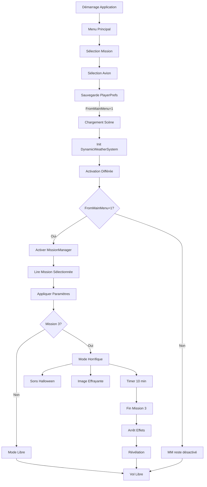
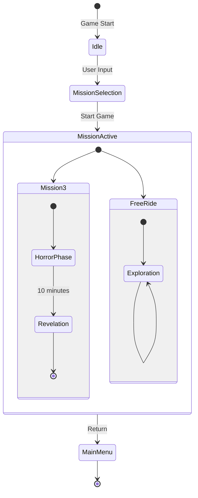
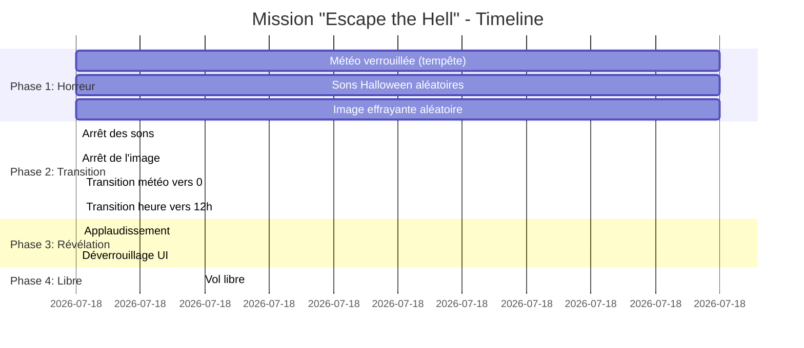
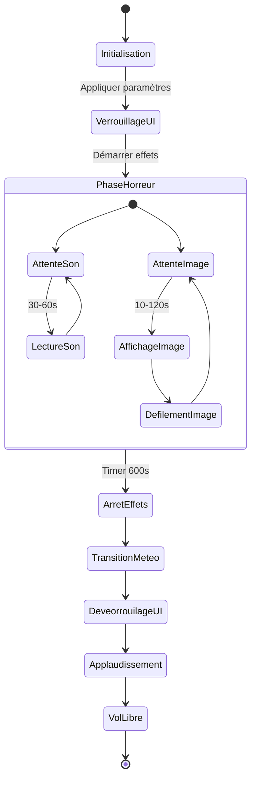
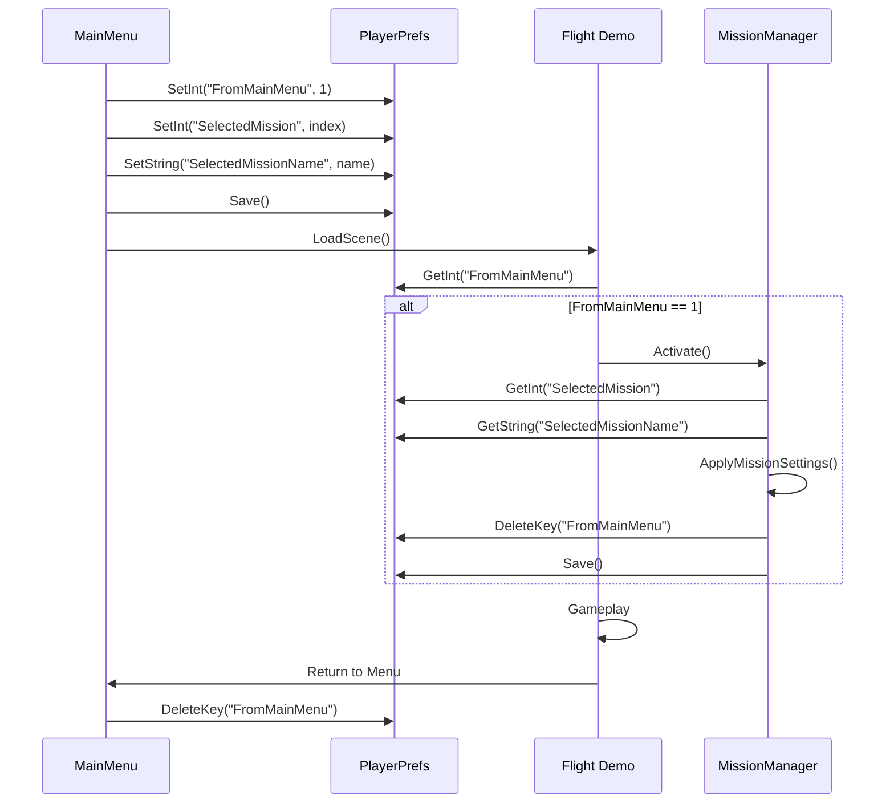
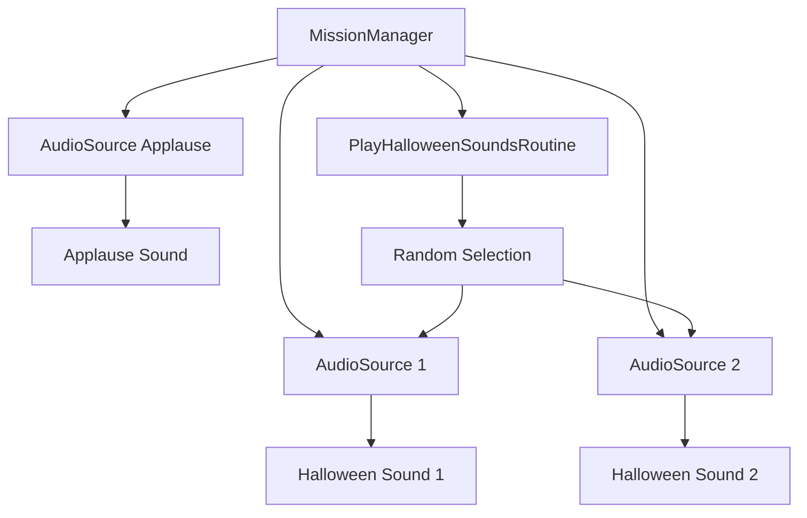

# Système de Missions - Documentation Technique

## Table des matières

1. [Vue d'ensemble](#vue-densemble)
2. [Architecture du système](#architecture-du-système)
3. [Mission "Escape the Hell"](#mission-escape-the-hell)
4. [Mode "Free Ride"](#mode-free-ride)
5. [Gestion des paramètres](#gestion-des-paramètres)
6. [Système audio](#système-audio)
7. [Système visuel](#système-visuel)
8. [Extension du système](#extension-du-système)

## Vue d'ensemble

Le système de missions de Tiny Flight Simulator permet de créer des expériences de vol scénarisées avec des paramètres et contraintes spécifiques.

### Objectifs du système

- Permettre des expériences narratives immersives
- Contrôler les paramètres environnementaux (météo, heure)
- Gérer les effets audio et visuels synchronisés
- Offrir une flexibilité pour l'ajout de nouvelles missions

### Composants principaux

| Composant | Responsabilité |
|-----------|----------------|
| `MissionManager.cs` | Gestionnaire central des missions |
| `DynamicWeatherSystem.cs` | Activation et paramètres météo |
| `GameMenuController.cs` | Interface et contrôles in-game |
| `MainMenuController.cs` | Sélection et lancement |
| `PlayerPrefs` | Persistance des choix utilisateur |

## Architecture du système

### Diagramme de flux



### État et transitions



### Activation conditionnelle

Le `MissionManager` n'est actif que lorsque lancé depuis le menu principal.

**Mécanisme**:
```csharp
// MainMenuController.cs
public void StartGame()
{
    PlayerPrefs.SetInt("FromMainMenu", 1);
    PlayerPrefs.Save();
    SceneManager.LoadScene("Flight Demo");
}

// DynamicWeatherSystem.cs
IEnumerator ActivateMissionManagerDelayed()
{
    yield return new WaitForEndOfFrame();
    yield return new WaitForSeconds(0.1f);
    
    int fromMainMenu = PlayerPrefs.GetInt("FromMainMenu", 0);
    
    if (fromMainMenu == 1)
    {
        PlayerPrefs.DeleteKey("FromMainMenu");
        PlayerPrefs.Save();
        
        // Activer le MissionManager
        if (missionManager != null)
        {
            missionManager.gameObject.SetActive(true);
        }
    }
}
```

**Raison du délai**:
- Attendre la fin du chargement de la scène
- Éviter les erreurs de références nulles
- Garantir l'initialisation complète des systèmes

## Mission "Escape the Hell"

### Concept narratif

**Philosophie**:
Mission immersive plaçant le joueur dans des conditions extrêmes pour tester sa capacité à maintenir le calme et le contrôle. La "révélation" après 10 minutes symbolise la récompense de la persévérance face à l'adversité.

**Expérience visée**:
- Tension psychologique via effets sonores et visuels
- Défi technique avec conditions météo difficiles
- Satisfaction du dépassement de soi
- Surprise et soulagement lors de la révélation

### Paramètres techniques

#### Configuration initiale

| Paramètre | Valeur | Justification |
|-----------|--------|---------------|
| `weatherIntensity` | 1.0 | Tempête maximale pour difficulté |
| `timeOfDay` | 24.0 (minuit) | Obscurité pour atmosphère horrifique |
| `lockWeatherSlider` | true | Empêche la triche |
| `lockTimeSlider` | true | Maintient l'immersion |
| `duration` | 600s | Équilibre entre défi et jouabilité |

**Code d'application**:
```csharp
void ApplyMissionSettings()
{
    int selectedMissionIndex = PlayerPrefs.GetInt("SelectedMission", -1);
    string selectedMissionName = PlayerPrefs.GetString("SelectedMissionName", "");
    
    bool isMission3Selected = false;
    if (selectedMissionName.Contains("mission3") || 
        selectedMissionName.Contains("Mission3"))
    {
        isMission3Selected = true;
    }
    
    if (isMission3Selected && selectedMissionIndex >= 0)
    {
        isMission3Active = true;
        
        // Appliquer météo
        if (weatherSystem != null)
        {
            weatherSystem.SetWeatherIntensity(mission3WeatherIntensity);
        }
        
        // Verrouiller les contrôles
        isMissionLocked = true;
        
        // Lancer les effets avec délai
        StartCoroutine(ApplyMission3SettingsDelayed());
        
        // Démarrer audio et visuel
        if (halloweenSound1 != null || halloweenSound2 != null)
        {
            halloweenSoundsCoroutine = StartCoroutine(PlayHalloweenSoundsRoutine());
        }
        
        if (scaryImage != null)
        {
            CreateScaryImageCanvas();
            scaryImageCoroutine = StartCoroutine(ShowScaryImageRoutine());
        }
        
        // Timer de fin
        StartCoroutine(EndMission3After10Minutes());
    }
}
```

#### Timeline détaillée



### Effets audio

#### Configuration des AudioSources

```csharp
void Start()
{
    // AudioSource 1 pour premier son
    halloweenAudioSource1 = gameObject.AddComponent<AudioSource>();
    halloweenAudioSource1.loop = false;
    halloweenAudioSource1.playOnAwake = false;
    halloweenAudioSource1.spatialBlend = 0f;  // 2D
    halloweenAudioSource1.volume = halloweenSoundVolume;
    halloweenAudioSource1.priority = 128;
    
    // AudioSource 2 pour second son (permet chevauchement)
    halloweenAudioSource2 = gameObject.AddComponent<AudioSource>();
    halloweenAudioSource2.loop = false;
    halloweenAudioSource2.playOnAwake = false;
    halloweenAudioSource2.spatialBlend = 0f;  // 2D
    halloweenAudioSource2.volume = halloweenSoundVolume;
    halloweenAudioSource2.priority = 128;
    
    // AudioSource pour applaudissement
    applauseAudioSource = gameObject.AddComponent<AudioSource>();
    applauseAudioSource.loop = false;
    applauseAudioSource.playOnAwake = false;
    applauseAudioSource.spatialBlend = 0f;  // 2D
}
```

**Justification des deux AudioSources**:
- Permettre le chevauchement de sons
- Éviter la coupure brutale d'un son en cours
- Créer une atmosphère plus dense

#### Routine de lecture aléatoire

```csharp
IEnumerator PlayHalloweenSoundsRoutine()
{
    while (isMission3Active)
    {
        // Intervalle aléatoire entre 30 et 60 secondes
        float waitTime = Random.Range(minSoundInterval, maxSoundInterval);
        yield return new WaitForSeconds(waitTime);
        
        // Choix aléatoire du son
        bool useSound1 = Random.value > 0.5f;
        
        if (useSound1 && halloweenSound1 != null && halloweenAudioSource1 != null)
        {
            halloweenAudioSource1.volume = halloweenSoundVolume;
            halloweenAudioSource1.PlayOneShot(halloweenSound1);
        }
        else if (!useSound1 && halloweenSound2 != null && halloweenAudioSource2 != null)
        {
            halloweenAudioSource2.volume = halloweenSoundVolume;
            halloweenAudioSource2.PlayOneShot(halloweenSound2);
        }
    }
}
```

**Paramètres recommandés**:
- `minSoundInterval`: 30s (évite la saturation)
- `maxSoundInterval`: 60s (maintient la tension)
- `halloweenSoundVolume`: 0.5 (audible mais pas écrasant)

**Sélection des sons**:
- Sons courts (2-5 secondes)
- Thématique horrifique (cris, gémissements, ambiances)
- Format: WAV ou OGG (compression)


### Effets visuels

#### Canvas et configuration

```csharp
void CreateScaryImageCanvas()
{
    // Canvas overlay au-dessus de tout
    GameObject canvasObject = new GameObject("ScaryImageCanvas");
    scaryImageCanvas = canvasObject.AddComponent<Canvas>();
    scaryImageCanvas.renderMode = RenderMode.ScreenSpaceOverlay;
    scaryImageCanvas.sortingOrder = 1000;  // Priorité maximale
    
    // CanvasScaler pour adaptation écran
    CanvasScaler scaler = canvasObject.AddComponent<CanvasScaler>();
    scaler.uiScaleMode = CanvasScaler.ScaleMode.ScaleWithScreenSize;
    scaler.referenceResolution = new Vector2(1920, 1080);
    
    // GraphicRaycaster (standard Unity UI)
    canvasObject.AddComponent<GraphicRaycaster>();
    
    // Objet Image
    scaryImageObject = new GameObject("ScaryImage");
    scaryImageObject.transform.SetParent(canvasObject.transform, false);
    
    Image imageComponent = scaryImageObject.AddComponent<Image>();
    imageComponent.sprite = scaryImage;
    imageComponent.preserveAspect = true;
    
    // Taille et position
    RectTransform rectTransform = scaryImageObject.GetComponent<RectTransform>();
    rectTransform.sizeDelta = new Vector2(scaryImageSize, scaryImageSize);
    
    // Cachée au départ
    scaryImageObject.SetActive(false);
}
```

#### Système de défilement

**Directions possibles**:
1. Bas vers Haut
2. Gauche vers Droite
3. Haut vers Bas
4. Droite vers Gauche

**Implémentation**:
```csharp
IEnumerator ScrollScaryImage()
{
    RectTransform rectTransform = scaryImageObject.GetComponent<RectTransform>();
    
    // Choix direction aléatoire
    int direction = Random.Range(0, 4);
    
    Vector2 startPos = Vector2.zero;
    Vector2 endPos = Vector2.zero;
    
    float screenWidth = Screen.width;
    float screenHeight = Screen.height;
    
    switch (direction)
    {
        case 0: // Bas vers Haut
            startPos = new Vector2(
                Random.Range(-screenWidth/2, screenWidth/2),
                -screenHeight/2 - scaryImageSize
            );
            endPos = new Vector2(
                startPos.x,
                screenHeight/2 + scaryImageSize
            );
            break;
            
        case 1: // Gauche vers Droite
            startPos = new Vector2(
                -screenWidth/2 - scaryImageSize,
                Random.Range(-screenHeight/2, screenHeight/2)
            );
            endPos = new Vector2(
                screenWidth/2 + scaryImageSize,
                startPos.y
            );
            break;
            
        case 2: // Haut vers Bas
            startPos = new Vector2(
                Random.Range(-screenWidth/2, screenWidth/2),
                screenHeight/2 + scaryImageSize
            );
            endPos = new Vector2(
                startPos.x,
                -screenHeight/2 - scaryImageSize
            );
            break;
            
        case 3: // Droite vers Gauche
            startPos = new Vector2(
                screenWidth/2 + scaryImageSize,
                Random.Range(-screenHeight/2, screenHeight/2)
            );
            endPos = new Vector2(
                -screenWidth/2 - scaryImageSize,
                startPos.y
            );
            break;
    }
    
    // Afficher l'image
    scaryImageObject.SetActive(true);
    rectTransform.anchoredPosition = startPos;
    
    // Calculer durée du défilement
    float distance = Vector2.Distance(startPos, endPos);
    float duration = distance / scaryImageSpeed;
    
    // Défilement progressif
    float elapsed = 0f;
    while (elapsed < duration)
    {
        elapsed += Time.deltaTime;
        float t = elapsed / duration;
        rectTransform.anchoredPosition = Vector2.Lerp(startPos, endPos, t);
        yield return null;
    }
    
    // Cacher à la fin
    scaryImageObject.SetActive(false);
}
```

**Routine d'affichage répété**:
```csharp
IEnumerator ShowScaryImageRoutine()
{
    while (isMission3Active)
    {
        // Intervalle aléatoire entre 10 et 120 secondes
        float waitTime = Random.Range(minImageInterval, maxImageInterval);
        yield return new WaitForSeconds(waitTime);
        
        // Faire défiler l'image
        if (scaryImageObject != null)
        {
            yield return StartCoroutine(ScrollScaryImage());
        }
    }
}
```

**Paramètres recommandés**:
- `scaryImageSize`: 200-300 pixels
- `scaryImageSpeed`: 500 px/s (visible mais rapide)
- `minImageInterval`: 10s (peut apparaître rapidement)
- `maxImageInterval`: 120s (max 2 minutes sans image)

**Sélection de l'image**:
- Format PNG avec transparence
- Résolution: 512x512 minimum
- Thématique horrifique cohérente avec les sons
- Contraste élevé pour visibilité


### Fin de mission

#### Séquence de transition

```csharp
IEnumerator EndMission3After10Minutes()
{
    // Attendre 10 minutes
    yield return new WaitForSeconds(mission3Duration);
    
    // Phase 1: Arrêt des effets
    isMission3Active = false;
    
    // Arrêter les sons
    if (halloweenSoundsCoroutine != null)
    {
        StopCoroutine(halloweenSoundsCoroutine);
        halloweenSoundsCoroutine = null;
    }
    
    if (halloweenAudioSource1 != null && halloweenAudioSource1.isPlaying)
        halloweenAudioSource1.Stop();
    
    if (halloweenAudioSource2 != null && halloweenAudioSource2.isPlaying)
        halloweenAudioSource2.Stop();
    
    // Arrêter l'image
    if (scaryImageCoroutine != null)
    {
        StopCoroutine(scaryImageCoroutine);
        scaryImageCoroutine = null;
    }
    
    if (scaryImageObject != null && scaryImageObject.activeSelf)
        scaryImageObject.SetActive(false);
    
    // Phase 2: Transition météo et heure
    if (weatherSystem != null)
    {
        weatherSystem.SetWeatherIntensity(mission3EndWeather);  // 0.0
    }
    
    if (gameMenuController != null)
    {
        gameMenuController.SetTimeValue(mission3EndTime);  // 12.0
    }
    
    // Phase 3: Déverrouillage UI
    if (gameMenuController != null)
    {
        gameMenuController.SetWeatherSliderLocked(false);
        gameMenuController.SetTimeSliderLocked(false);
    }
    
    // Phase 4: Applaudissement
    yield return new WaitForSeconds(1f);
    
    if (applauseSound != null && applauseAudioSource != null)
    {
        applauseAudioSource.volume = applauseSoundVolume;
        applauseAudioSource.PlayOneShot(applauseSound);
    }
    
    isMissionLocked = false;
}
```

**Durées et timing**:
| Action | Délai | Justification |
|--------|-------|---------------|
| Durée totale | 600s | Équilibre défi/jouabilité |
| Arrêt effets | Immédiat | Soulagement instantané |
| Transition météo | ~5s | Smooth (géré par système) |
| Avant applaudissement | 1s | Laisser assimiler la transition |
| Durée applaudissement | 3-5s | Célébration satisfaisante |

**Paramètres de fin**:
- `mission3EndWeather`: 0.0 (ciel clair)
- `mission3EndTime`: 12.0 (midi, contraste maximal avec minuit)
- `applauseSoundVolume`: 0.7 (volume élevé pour récompense)

### Diagramme d'état Mission 3



## Mode "Free Ride"

### Concept

Mode sandbox sans contraintes permettant:
- Exploration libre du monde procédural
- Apprentissage des contrôles
- Tests de différentes conditions météo
- Détente et découverte

### Configuration

**Paramètres par défaut**:
```csharp
else  // Free Ride ou autre mission
{
    isMissionLocked = false;
    
    if (gameMenuController != null)
    {
        gameMenuController.SetWeatherSliderLocked(false);
        gameMenuController.SetTimeSliderLocked(false);
    }
}
```

**Caractéristiques**:
- Aucun verrouillage de paramètres
- Pas d'effets audio/visuels forcés
- Pas de limite de temps
- Météo ajustable en temps réel
- Heure ajustable en temps réel


## Gestion des paramètres

### PlayerPrefs utilisées

| Clé | Type | Description | Valeurs |
|-----|------|-------------|---------|
| `FromMainMenu` | int | Flag d'activation MissionManager | 0=non, 1=oui |
| `SelectedMission` | int | Index mission sélectionnée | 0-N |
| `SelectedMissionName` | string | Nom de la mission | "mission3", "freeride" |
| `SelectedAircraft` | int | Index avion sélectionné | 0-N |
| `AircraftColorCode` | string | Code couleur avion | Hex color |

### Cycle de vie des PlayerPrefs



### Interface GameMenuController

**Méthodes de contrôle**:
```csharp
// Verrouillage des sliders
public void SetWeatherSliderLocked(bool locked)
{
    if (weatherSlider != null)
    {
        weatherSlider.interactable = !locked;
        
        // Visual feedback (optionnel)
        ColorBlock colors = weatherSlider.colors;
        colors.disabledColor = locked ? Color.gray : Color.white;
        weatherSlider.colors = colors;
    }
}

public void SetTimeSliderLocked(bool locked)
{
    if (timeSlider != null)
    {
        timeSlider.interactable = !locked;
    }
}

// Application des valeurs
public void SetWeatherValue(float value)
{
    if (weatherSlider != null)
    {
        weatherSlider.value = value;
    }
    
    if (weatherSystem != null)
    {
        weatherSystem.SetWeatherIntensity(value);
    }
}

public void SetTimeValue(float value)
{
    if (timeSlider != null)
    {
        timeSlider.value = value;
    }
    
    if (timeOfDaySystem != null)  // À vérifier
    {
        timeOfDaySystem.SetHour(value);
    }
}
```


## Système audio

### Architecture audio



### Configuration AudioSource

**Paramètres importants**:
```csharp
audioSource.loop = false;              // One-shot
audioSource.playOnAwake = false;       // Contrôle manuel
audioSource.spatialBlend = 0f;         // 2D (non spatialisé)
audioSource.volume = 0.5f;             // Volume modéré
audioSource.priority = 128;            // Priorité moyenne
```

**Justification spatialBlend = 0**:
- Sons d'ambiance/UI, pas liés à une position 3D
- Volume constant quelle que soit la position du joueur
- Évite les calculs de spatialisation inutiles

### Gestion des chevauchements

**Problème**:
Si un seul AudioSource est utilisé, un nouveau son coupe le précédent.

**Solution**:
Utiliser deux AudioSources permet:
- Chevauchement de deux sons
- Atmosphère plus dense
- Pas de coupure brutale

**Exemple de timeline**:
```
0s    [AudioSource1] Son 1 ─────────────┐
                                        │
30s   [AudioSource2]         Son 2 ─────┼───────┐
                                        │       │
45s   [AudioSource1]                 Son 1      │
                                                │
60s   [AudioSource2]                         Son 2
```

### Sélection aléatoire

**Algorithme**:
```csharp
bool useSound1 = Random.value > 0.5f;  // 50% chaque son
```

**Alternatives possibles**:
```csharp
// Alternance garantie
int soundIndex = (lastSoundIndex + 1) % 2;

// Probabilité pondérée
bool useSound1 = Random.value > 0.3f;  // 70% son1, 30% son2
```

## Système visuel

### Architecture Canvas

**Hiérarchie**:
```
ScaryImageCanvas (Canvas)
├── CanvasScaler
├── GraphicRaycaster
└── ScaryImage (Image)
    └── RectTransform
```

**RenderMode**: `ScreenSpaceOverlay`
- Toujours au-dessus du rendu 3D
- Pas affecté par les caméras
- Adapté pour l'UI globale

**SortingOrder**: 1000
- Garantit l'affichage au-dessus de tous les autres Canvas
- UI de jeu typiquement à 0-100
- Mission 3 image à 1000 = priorité absolue

### Calcul des positions

**Système de coordonnées**:
- Centre de l'écran: (0, 0)
- Ancrage: Centre
- Pivot: Centre

**Positions de départ**:
```csharp
// Bas: X aléatoire, Y sous l'écran
startPos = new Vector2(
    Random.Range(-screenWidth/2, screenWidth/2),
    -screenHeight/2 - scaryImageSize
);

// Haut: X aléatoire, Y au-dessus de l'écran
startPos = new Vector2(
    Random.Range(-screenWidth/2, screenWidth/2),
    screenHeight/2 + scaryImageSize
);

// Gauche: X gauche de l'écran, Y aléatoire
startPos = new Vector2(
    -screenWidth/2 - scaryImageSize,
    Random.Range(-screenHeight/2, screenHeight/2)
);

// Droite: X droite de l'écran, Y aléatoire
startPos = new Vector2(
    screenWidth/2 + scaryImageSize,
    Random.Range(-screenHeight/2, screenHeight/2)
);
```

**Offset de taille**:
L'image démarre complètement hors écran grâce à `- scaryImageSize`, garantissant qu'elle n'est pas partiellement visible avant le défilement.

### Animation de défilement

**Interpolation linéaire**:
```csharp
float t = elapsed / duration;  // 0.0 à 1.0
rectTransform.anchoredPosition = Vector2.Lerp(startPos, endPos, t);
```

**Vitesse constante**:
```csharp
float distance = Vector2.Distance(startPos, endPos);
float duration = distance / scaryImageSpeed;
```

Cette approche garantit que l'image se déplace à la même vitesse quelle que soit la direction ou la résolution de l'écran.

**Alternatives**:
```csharp
// Animation par courbe
float t = Mathf.SmoothStep(0, 1, elapsed / duration);  // Ease in/out

// Animation avec bounce
float t = Mathf.Sin(elapsed / duration * Mathf.PI * 0.5f);  // Ease out
```

### Optimisations visuelles

**Désactivation quand invisible**:
```csharp
scaryImageObject.SetActive(false);  // Pas de rendu
```

**PreserveAspect**:
```csharp
imageComponent.preserveAspect = true;  // Pas de déformation
```

**CanvasScaler**:
```csharp
scaler.uiScaleMode = CanvasScaler.ScaleMode.ScaleWithScreenSize;
scaler.referenceResolution = new Vector2(1920, 1080);
```
Adaptation automatique à différentes résolutions d'écran.

## Extension du système

### Ajouter une nouvelle mission

**Étape 1: Définir les paramètres**
```csharp
[Header("Mission 4 - Paramètres")]
public float mission4WeatherIntensity = 0.5f;
public float mission4TimeOfDay = 6f;  // Aube
public AudioClip mission4Music;
// ... autres paramètres
```

**Étape 2: Détecter la mission**
```csharp
void ApplyMissionSettings()
{
    int selectedMissionIndex = PlayerPrefs.GetInt("SelectedMission", -1);
    string selectedMissionName = PlayerPrefs.GetString("SelectedMissionName", "");
    
    if (selectedMissionName.Contains("mission4"))
    {
        ApplyMission4Settings();
    }
    else if (selectedMissionName.Contains("mission3"))
    {
        // Mission 3 existante
    }
    // ...
}
```

**Étape 3: Implémenter la logique**
```csharp
void ApplyMission4Settings()
{
    // Appliquer paramètres
    if (weatherSystem != null)
    {
        weatherSystem.SetWeatherIntensity(mission4WeatherIntensity);
    }
    
    // Démarrer effets spécifiques
    StartCoroutine(Mission4Routine());
}

IEnumerator Mission4Routine()
{
    // Logique de la mission
    yield return null;
}
```

**Étape 4: Ajouter à l'UI**
- Créer bouton dans MainMenu
- Assigner index et nom de mission
- Configurer la sélection

### Ajouter des effets

**Nouvel effet visuel**:
```csharp
[Header("Effet Visuel Custom")]
public Sprite customSprite;
public float customEffectDuration = 5f;

IEnumerator ShowCustomEffect()
{
    // Créer et afficher l'effet
    GameObject effectObject = new GameObject("CustomEffect");
    Image img = effectObject.AddComponent<Image>();
    img.sprite = customSprite;
    
    // Animation
    float elapsed = 0f;
    while (elapsed < customEffectDuration)
    {
        elapsed += Time.deltaTime;
        // Animation logic
        yield return null;
    }
    
    Destroy(effectObject);
}
```

**Nouvel effet audio**:
```csharp
[Header("Effet Audio Custom")]
public AudioClip customSound;
public float customSoundInterval = 45f;

IEnumerator PlayCustomSoundRoutine()
{
    while (isEffectActive)
    {
        yield return new WaitForSeconds(customSoundInterval);
        
        AudioSource.PlayClipAtPoint(customSound, Camera.main.transform.position);
    }
}
```

### Système d'objectifs

**Structure de base**:
```csharp
[System.Serializable]
public class MissionObjective
{
    public string objectiveName;
    public string description;
    public bool isCompleted;
    public ObjectiveType type;
}

public enum ObjectiveType
{
    ReachAltitude,
    ReachLocation,
    SurviveTime,
    LandAtAirport,
    Custom
}

public List<MissionObjective> currentObjectives = new List<MissionObjective>();

public void CheckObjectives()
{
    foreach (var objective in currentObjectives)
    {
        if (!objective.isCompleted)
        {
            switch (objective.type)
            {
                case ObjectiveType.ReachAltitude:
                    // Vérifier altitude
                    break;
                case ObjectiveType.SurviveTime:
                    // Vérifier temps écoulé
                    break;
                // ...
            }
        }
    }
}
```

**À implémenter**: Système d'objectifs complet avec UI

### Système de scoring

**Structure proposée**:
```csharp
public class MissionScore
{
    public int timeBonus;
    public int difficultyMultiplier;
    public int completionBonus;
    public int totalScore;
    
    public void CalculateScore(float completionTime, float missionDuration)
    {
        timeBonus = Mathf.Max(0, (int)((missionDuration - completionTime) * 10));
        totalScore = timeBonus * difficultyMultiplier + completionBonus;
    }
}
```

## Conclusion

Le système de missions de Tiny Flight Simulator offre une base solide pour créer des expériences de vol variées. La mission "Escape the Hell" démontre la capacité du système à créer des scénarios immersifs avec synchronisation audio-visuelle et contrôle précis des paramètres environnementaux.

**Forces du système**:
- Architecture modulaire et extensible
- Synchronisation précise des effets
- Contrôle granulaire des paramètres
- Séparation claire mission/free ride

**Pistes d'amélioration**:
- Système d'objectifs structuré
- Scoring et récompenses
- Missions multiples enchaînées
- Événements scriptés plus complexes
- Système de dialogues/narration

---

*Document mis à jour: Décembre 2025*
