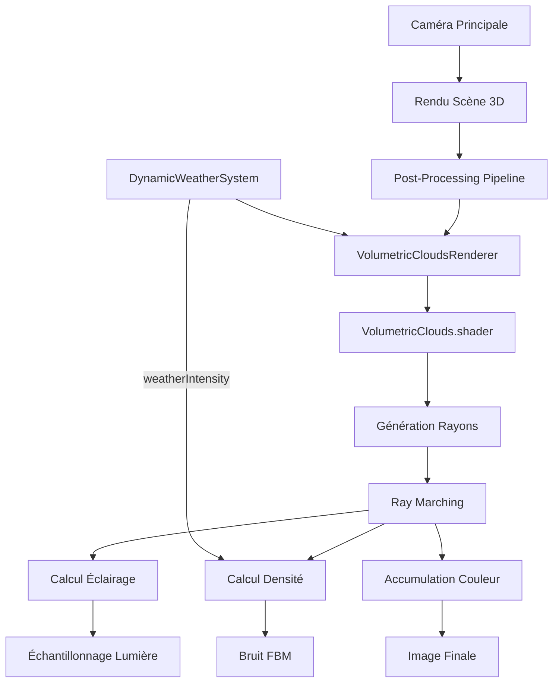
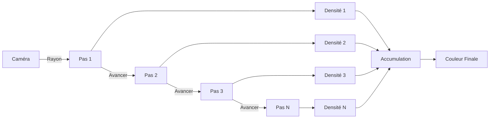
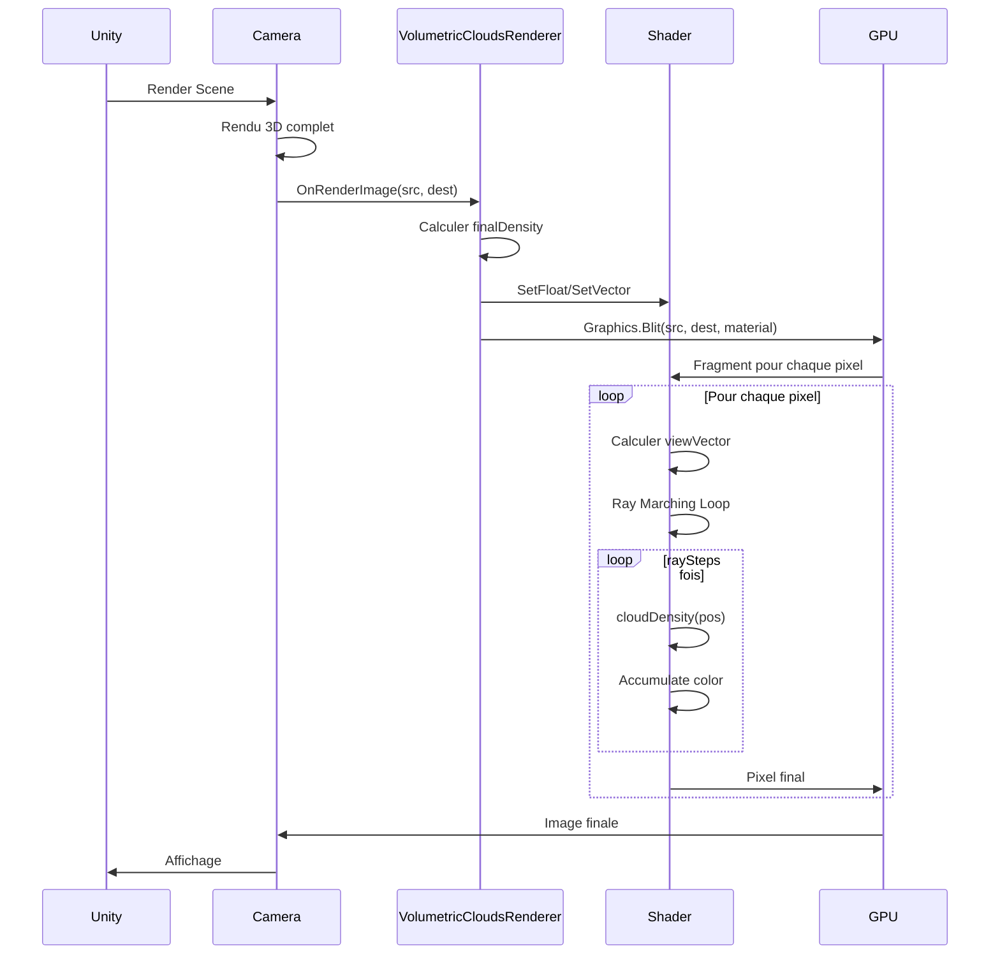
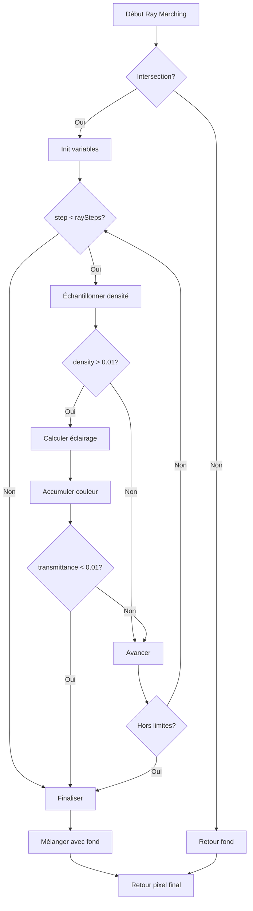

# Systèmes de Rendu Avancés - Documentation Technique

## Table des matières

1. [Vue d'ensemble](#vue-densemble)
2. [Nuages volumétriques (Ray Marching)](#nuages-volumétriques-ray-marching)
3. [Shader VolumetricClouds](#shader-volumetricclouds)
4. [Composant VolumetricCloudsRenderer](#composant-volumetriccloudsrenderer)
5. [Intégration avec le système météo](#intégration-avec-le-système-météo)
6. [Performance et optimisation](#performance-et-optimisation)
7. [Configuration et paramétrage](#configuration-et-paramétrage)

## Vue d'ensemble

Le système de rendu avancé implémente des techniques de rendu volumétrique pour créer des nuages réalistes et dynamiques intégrés au système météorologique.

### Techniques utilisées

- **Ray Marching** - Traversée de volumes 3D
- **FBM (Fractional Brownian Motion)** - Génération de bruit procédural
- **Post-Processing** - Application en post-traitement caméra
- **Absorption de lumière** - Calcul d'éclairage volumétrique

### Architecture




## Nuages volumétriques (Ray Marching)

### Principe du Ray Marching

Le Ray Marching est une technique de rendu volumétrique qui consiste à:

1. Lancer un rayon depuis la caméra pour chaque pixel
2. Avancer le long du rayon par pas (steps)
3. À chaque pas, échantillonner la densité du volume
4. Accumuler la couleur et la transmittance
5. Combiner avec l'image de fond



### Avantages et inconvénients

**Avantages**:

- Nuages réalistes et volumétriques
- Éclairage physiquement correct
- Animation fluide
- Contrôle précis de la densité

**Inconvénients**:

- Coût GPU élevé
- Dépendant du nombre de pas (raySteps)
- Peut causer des baisses de FPS

## Shader VolumetricClouds

### Structure du shader

**Fichier**: `Assets/Shaders/VolumetricClouds.shader`

#### Properties

```hlsl
Properties
{
    _MainTex ("Texture", 2D) = "white" {}
    _CloudDensity ("Cloud Density", Range(0, 2)) = 0.5
    _CloudScale ("Cloud Scale", Range(0.1, 10)) = 1.0
    _CloudSpeed ("Cloud Speed", Range(0, 5)) = 0.5
    _CloudHeight ("Cloud Height", Range(100, 5000)) = 1000
    _CloudThickness ("Cloud Thickness", Range(100, 2000)) = 500
    _RaySteps ("Ray Steps", Range(10, 100)) = 50
    _LightAbsorption ("Light Absorption", Range(0, 1)) = 0.3
    _SunColor ("Sun Color", Color) = (1, 0.95, 0.8, 1)
    _CloudColor ("Cloud Color", Color) = (0.9, 0.9, 0.95, 1)
}
```

**Paramètres**:
| Propriété | Type | Plage | Description |
|-----------|------|-------|-------------|
| `_CloudDensity` | float | 0-2 | Densité globale des nuages |
| `_CloudScale` | float | 0.1-10 | Échelle du bruit (plus petit = nuages plus petits) |
| `_CloudSpeed` | float | 0-5 | Vitesse de déplacement |
| `_CloudHeight` | float | 100-5000 | Altitude de la couche |
| `_CloudThickness` | float | 100-2000 | Épaisseur de la couche |
| `_RaySteps` | int | 10-100 | Nombre de pas (qualité vs performance) |
| `_LightAbsorption` | float | 0-1 | Absorption de lumière par les nuages |
| `_SunColor` | Color | - | Couleur du soleil |
| `_CloudColor` | Color | - | Couleur de base des nuages |

#### Fonctions de bruit

**Hash 3D**:

```hlsl
float hash(float3 p)
{
    p = frac(p * 0.3183099 + 0.1);
    p *= 17.0;
    return frac(p.x * p.y * p.z * (p.x + p.y + p.z));
}
```

Génère une valeur pseudo-aléatoire basée sur une position 3D.

**Noise 3D**:

```hlsl
float noise3D(float3 p)
{
    float3 i = floor(p);
    float3 f = frac(p);
    f = f * f * (3.0 - 2.0 * f);  // Smooth interpolation

    // Interpolation trilinéaire entre 8 coins du cube
    return lerp(
        lerp(lerp(hash(i + float3(0,0,0)), hash(i + float3(1,0,0)), f.x),
             lerp(hash(i + float3(0,1,0)), hash(i + float3(1,1,0)), f.x), f.y),
        lerp(lerp(hash(i + float3(0,0,1)), hash(i + float3(1,0,1)), f.x),
             lerp(hash(i + float3(0,1,1)), hash(i + float3(1,1,1)), f.x), f.y),
        f.z);
}
```

**FBM (Fractional Brownian Motion)**:

```hlsl
float fbm(float3 p)
{
    float value = 0.0;
    float amplitude = 0.5;
    float frequency = 1.0;

    // 4 octaves de bruit
    for(int i = 0; i < 4; i++)
    {
        value += amplitude * noise3D(p * frequency);
        frequency *= 2.0;  // Double la fréquence
        amplitude *= 0.5;  // Réduit l'amplitude
    }

    return value;
}
```

**Justification FBM**:

- Combine plusieurs octaves de bruit
- Produit des détails à différentes échelles
- Résultat plus naturel et organique
- Standard pour génération procédurale

#### Fonction de densité

```hlsl
float cloudDensity(float3 p)
{
    // Animation dans le temps
    p.xz += _Time.y * _CloudSpeed * 10.0;

    // Limitation verticale (couche de nuages)
    float heightFactor = 1.0 - abs(p.y - _CloudHeight) / (_CloudThickness * 0.5);
    heightFactor = saturate(heightFactor);

    if(heightFactor <= 0.0) return 0.0;

    // Génération nuages avec FBM
    float density = fbm(p * _CloudScale * 0.001);
    density = smoothstep(0.3, 0.7, density);  // Contraste

    return density * heightFactor * _CloudDensity;
}
```

**Composants**:

1. **Animation**: Déplacement XZ basé sur temps
2. **Height Factor**: Atténuation gaussienne selon altitude
3. **FBM**: Génération procédurale
4. **Smoothstep**: Augmente le contraste (seuil 0.3-0.7)

#### Vertex Shader

```hlsl
v2f vert (appdata v)
{
    v2f o;
    o.vertex = UnityObjectToClipPos(v.vertex);
    o.uv = TRANSFORM_TEX(v.uv, _MainTex);

    // Calculer vecteur de vue pour ray marching
    float4 viewPos = mul(unity_CameraInvProjection, float4(v.uv * 2 - 1, 0, -1));
    o.viewVector = mul(unity_CameraToWorld, float4(viewPos.xyz, 0)).xyz;

    return o;
}
```

**Calcul du viewVector**:

1. UV (0-1) transformé en NDC (-1 à 1)
2. Inverse de la projection caméra
3. Transformation dans l'espace monde
4. Donne la direction du rayon pour chaque pixel

#### Fragment Shader - Ray Marching

**Initialisation**:

```hlsl
float4 frag (v2f i) : SV_Target
{
    float4 col = tex2D(_MainTex, i.uv);  // Scène de fond

    // Direction du rayon
    float3 rayDir = normalize(i.viewVector);
    float3 rayOrigin = _CameraPos;

    // Paramètres ray marching
    float stepSize = _CloudThickness / _RaySteps;
    float totalDensity = 0.0;
    float transmittance = 1.0;
    float3 cloudCol = float3(0, 0, 0);
```

**Intersection avec couche de nuages**:

```hlsl
    float startHeight = _CloudHeight - _CloudThickness * 0.5;
    float endHeight = _CloudHeight + _CloudThickness * 0.5;

    // Calculer point d'entrée dans la couche
    float t = 0.0;
    if(rayOrigin.y < startHeight && rayDir.y > 0)
    {
        t = (startHeight - rayOrigin.y) / rayDir.y;
    }
    else if(rayOrigin.y > endHeight && rayDir.y < 0)
    {
        t = (endHeight - rayOrigin.y) / rayDir.y;
    }
    else if(rayOrigin.y >= startHeight && rayOrigin.y <= endHeight)
    {
        t = 0.0;
    }
    else
    {
        return col;  // Pas d'intersection
    }
```

**Boucle de marching**:

```hlsl
    float3 currentPos = rayOrigin + rayDir * t;

    for(int step = 0; step < (int)_RaySteps; step++)
    {
        float density = cloudDensity(currentPos);

        if(density > 0.01)
        {
            // Échantillonner éclairage
            float lightSample = cloudDensity(currentPos + _SunDirection * 50.0);
            float lighting = exp(-lightSample * _LightAbsorption);

            // Accumulation
            float3 sampleColor = lerp(_CloudColor.rgb, _SunColor.rgb, lighting);
            cloudCol += sampleColor * density * transmittance * stepSize;
            transmittance *= exp(-density * stepSize * _LightAbsorption);

            if(transmittance < 0.01) break;  // Sortie anticipée
        }

        currentPos += rayDir * stepSize;

        // Sortir si hors de la couche
        if(currentPos.y < startHeight || currentPos.y > endHeight)
            break;
    }

    // Mélanger avec le ciel
    float alpha = 1.0 - transmittance;
    col.rgb = lerp(col.rgb, cloudCol, alpha);

    return col;
}
```

**Équation d'accumulation**:

```
cloudColor += sampleColor * density * transmittance * stepSize
transmittance *= exp(-density * stepSize * absorption)
```

**Sortie anticipée**:

- `if(transmittance < 0.01) break;` - Stop si opaque
- `if(currentPos.y < startHeight || currentPos.y > endHeight) break;` - Hors couche

### Calcul d'éclairage

**Light Sampling**:

```hlsl
float lightSample = cloudDensity(currentPos + _SunDirection * 50.0);
float lighting = exp(-lightSample * _LightAbsorption);
```

**Principe**:

1. Échantillonner la densité dans la direction du soleil
2. Plus la densité est élevée, moins de lumière passe
3. Utiliser exponentielle pour atténuation réaliste

**Couleur finale**:

```hlsl
float3 sampleColor = lerp(_CloudColor.rgb, _SunColor.rgb, lighting);
```

Interpolation entre couleur de base des nuages et couleur du soleil selon l'éclairage.

## Composant VolumetricCloudsRenderer

### Structure de la classe

**Fichier**: `Assets/Scripts/VolumetricCloudsRenderer.cs`

```csharp
[ExecuteInEditMode]
[RequireComponent(typeof(Camera))]
public class VolumetricCloudsRenderer : MonoBehaviour
{
    // Shader et matériau
    public Shader volumetricCloudsShader;
    private Material cloudMaterial;
    private Camera cam;

    // Paramètres des nuages
    public float cloudDensity = 0.5f;
    public float cloudScale = 1.0f;
    public float cloudSpeed = 0.5f;
    public float cloudHeight = 1000f;
    public float cloudThickness = 500f;

    // Qualité
    public int raySteps = 50;
    public float lightAbsorption = 0.3f;

    // Couleurs
    public Color sunColor = new Color(1f, 0.95f, 0.8f);
    public Color cloudColor = new Color(0.9f, 0.9f, 0.95f);

    // Intégration météo
    public DynamicWeatherSystem weatherSystem;
    public bool useWeatherIntensity = true;
    public float stormDensityMultiplier = 2.0f;
}
```

### Initialisation

```csharp
void Start()
{
    cam = GetComponent<Camera>();

    if (volumetricCloudsShader == null)
    {
        Debug.LogError("VolumetricCloudsRenderer: Shader non assigné!");
        enabled = false;
        return;
    }

    cloudMaterial = new Material(volumetricCloudsShader);

    // Trouver le système météo si non assigné
    if (weatherSystem == null)
    {
        weatherSystem = FindObjectOfType<DynamicWeatherSystem>();
    }
}
```

### Rendu post-processing

```csharp
void OnRenderImage(RenderTexture src, RenderTexture dest)
{
    if (cloudMaterial == null)
    {
        Graphics.Blit(src, dest);
        return;
    }

    // Calculer densité avec météo
    float finalDensity = cloudDensity;
    if (useWeatherIntensity && weatherSystem != null)
    {
        float weatherIntensity = weatherSystem.weatherIntensity;
        finalDensity = cloudDensity * Mathf.Lerp(0.3f, stormDensityMultiplier, weatherIntensity);
    }

    // Passer paramètres au shader
    cloudMaterial.SetFloat("_CloudDensity", finalDensity);
    cloudMaterial.SetFloat("_CloudScale", cloudScale);
    cloudMaterial.SetFloat("_CloudSpeed", cloudSpeed);
    cloudMaterial.SetFloat("_CloudHeight", cloudHeight);
    cloudMaterial.SetFloat("_CloudThickness", cloudThickness);
    cloudMaterial.SetFloat("_RaySteps", raySteps);
    cloudMaterial.SetFloat("_LightAbsorption", lightAbsorption);
    cloudMaterial.SetColor("_SunColor", sunColor);
    cloudMaterial.SetColor("_CloudColor", cloudColor);

    // Position caméra et direction soleil
    cloudMaterial.SetVector("_CameraPos", cam.transform.position);

    Vector3 sunDir = Vector3.down;
    if (weatherSystem != null && weatherSystem.sunLight != null)
    {
        sunDir = -weatherSystem.sunLight.transform.forward;
    }
    cloudMaterial.SetVector("_SunDirection", sunDir);

    // Appliquer l'effet
    Graphics.Blit(src, dest, cloudMaterial);
}
```

**Pipeline**:

1. **OnRenderImage** appelé après rendu de la scène
2. `src` = Image de la scène rendue
3. Application du shader volumétrique
4. `dest` = Image finale avec nuages

### Nettoyage

```csharp
void OnDestroy()
{
    if (cloudMaterial != null)
    {
        DestroyImmediate(cloudMaterial);
    }
}
```

**Important**: Détruire le matériau créé dynamiquement pour éviter les fuites mémoire.

### Interface publique

```csharp
/// <summary>
/// Active ou désactive le rendu des nuages
/// </summary>
public void SetEnabled(bool enable)
{
    enabled = enable;
}

/// <summary>
/// Définit la densité des nuages directement
/// </summary>
public void SetCloudDensity(float density)
{
    cloudDensity = Mathf.Clamp(density, 0f, 2f);
}
```

## Intégration avec le système météo

### Configuration dans Unity

**Hiérarchie**:

```
MainCamera
├── Camera (Component)
├── VolumetricCloudsRenderer (Component)
│   ├── volumetricCloudsShader: VolumetricClouds
│   ├── weatherSystem: DynamicWeatherSystem
│   └── useWeatherIntensity: true
└── ... autres composants
```

### Adaptation dynamique

**Formule de densité**:

```csharp
float finalDensity = cloudDensity * Mathf.Lerp(0.3f, stormDensityMultiplier, weatherIntensity);
```

**Tableau de correspondance**:
| weatherIntensity | Multiplicateur | Densité finale (base=0.5) |
|------------------|----------------|---------------------------|
| 0.0 | 0.3 | 0.15 (nuages légers) |
| 0.5 | 1.15 | 0.575 (nuages modérés) |
| 1.0 | 2.0 | 1.0 (nuages denses) |

**Justification**:

- Beau temps (0.0): Nuages légers et dispersés
- Tempête (1.0): Nuages denses et opaques
- Transition fluide entre les deux

### Synchronisation avec DynamicWeatherSystem

**Dans DynamicWeatherSystem.cs** (ajouté):

```csharp
[Tooltip("Rendu volumétrique des nuages (Ray Marching)")]
public VolumetricCloudsRenderer volumetricClouds;

void UpdateWeather()
{
    // ... autres mises à jour

    // Les nuages s'adaptent automatiquement via weatherIntensity
    // Pas de code supplémentaire nécessaire
}
```

**Avantage**:
Le `VolumetricCloudsRenderer` lit directement `weatherIntensity` à chaque frame, garantissant la synchronisation automatique.

## Performance et optimisation

### Coût de rendu

**Facteurs de performance**:

1. **Nombre de pixels** - Résolution d'écran
2. **raySteps** - Nombre de pas (linéaire)
3. **Densité de nuages** - Zones opaques terminent plus tôt
4. **Complexité du bruit** - 4 octaves FBM

**Impact estimé**:
| raySteps | FPS @ 1080p | FPS @ 1440p | FPS @ 4K |
|----------|-------------|-------------|----------|
| 20 | 55-60 | 45-50 | 25-30 |
| 50 | 35-45 | 25-35 | 15-20 |
| 100 | 20-30 | 15-20 | 8-12 |

**Configuration GPU**:

- GTX 1060: 30-40 FPS @ 1080p (raySteps=50)
- RTX 2060: 45-55 FPS @ 1080p (raySteps=50)
- RTX 3070: 55-60 FPS @ 1080p (raySteps=50)

**À vérifier**: Tests réels sur différentes configurations

### Optimisations implémentées

**1. Sortie anticipée**:

```hlsl
if(transmittance < 0.01) break;  // Opacité complète
if(density < 0.01) continue;      // Zone vide
```

**2. Limitation verticale**:

```hlsl
if(currentPos.y < startHeight || currentPos.y > endHeight)
    break;  // Hors de la couche
```

**3. Calcul hébergement**:

```hlsl
float heightFactor = 1.0 - abs(p.y - _CloudHeight) / (_CloudThickness * 0.5);
if(heightFactor <= 0.0) return 0.0;  // Pas de calcul FBM inutile
```

### Optimisations possibles

**1. Adaptive Sampling**:

```hlsl
// Ajuster stepSize selon distance
float distance = length(currentPos - rayOrigin);
float adaptiveStepSize = stepSize * (1.0 + distance * 0.001);
```

**2. LOD based on distance**:

```csharp
float distance = Vector3.Distance(cam.transform.position, cloudLayerCenter);
int adaptiveRaySteps = distance < 2000f ? raySteps : raySteps / 2;
```

**3. Compute Shader**:

```csharp
// Déplacer le ray marching vers compute shader
// Parallélisation massive sur GPU
ComputeShader cloudComputeShader;
```

**4. Temporal Reprojection**:

```hlsl
// Réutiliser les résultats des frames précédentes
// Calculer seulement 1/4 des pixels par frame
```

**5. Blue Noise Sampling**:

```hlsl
// Utiliser blue noise pour offset aléatoire du ray
// Réduit les artefacts de banding
```

### Paramètres de qualité

**Qualité faible**:

```csharp
raySteps = 20;
cloudScale = 2.0f;  // Nuages plus gros = moins de détails
lightAbsorption = 0.5f;  // Simplification éclairage
```

**Qualité moyenne**:

```csharp
raySteps = 50;
cloudScale = 1.0f;
lightAbsorption = 0.3f;
```

**Qualité élevée**:

```csharp
raySteps = 100;
cloudScale = 0.5f;  // Plus de détails
lightAbsorption = 0.2f;  // Éclairage plus subtil
```

## Configuration et paramétrage

### Paramètres artistiques

**Nuages légers et dispersés**:

```csharp
cloudDensity = 0.3f;
cloudScale = 1.5f;
cloudColor = Color.white;
lightAbsorption = 0.2f;
```

**Nuages d'orage denses**:

```csharp
cloudDensity = 1.5f;
cloudScale = 0.8f;
cloudColor = new Color(0.5f, 0.5f, 0.6f);  // Gris foncé
lightAbsorption = 0.5f;
```

**Nuages de coucher de soleil**:

```csharp
cloudDensity = 0.6f;
cloudScale = 1.0f;
cloudColor = new Color(1f, 0.8f, 0.6f);  // Orange
sunColor = new Color(1f, 0.5f, 0.3f);   // Rouge-orange
lightAbsorption = 0.3f;
```

### Altitude et épaisseur

**Nuages bas (stratus)**:

```csharp
cloudHeight = 500f;
cloudThickness = 300f;
```

**Nuages moyens (cumulus)**:

```csharp
cloudHeight = 1500f;
cloudThickness = 800f;
```

**Nuages hauts (cirrus)**:

```csharp
cloudHeight = 4000f;
cloudThickness = 500f;
cloudDensity = 0.2f;  // Plus légers
```

### Animation

**Statique**:

```csharp
cloudSpeed = 0f;
```

**Vent léger**:

```csharp
cloudSpeed = 0.5f;
```

**Vent fort**:

```csharp
cloudSpeed = 2.0f;
```

**Tempête**:

```csharp
cloudSpeed = 5.0f;
```

## Diagrammes techniques

### Pipeline de rendu



### Optimisation du ray marching



## Conclusion

Le système de rendu volumétrique implémente des nuages réalistes via Ray Marching avec intégration au système météo. Bien que coûteux en performance, les optimisations et paramètres de qualité permettent d'adapter le rendu à différentes configurations matérielles.

**Points forts**:

- Réalisme visuel élevé
- Intégration météo automatique
- Paramétrage artistique flexible
- Animation fluide

**Points à améliorer**:

- Optimisation performance (compute shader, temporal reprojection)
- Paramètres de qualité exposés dans UI
- LOD automatique selon distance/performance
- Profiling et mesures précises
- Support multi-couches de nuages

**Recommandations d'usage**:

- Activer uniquement sur configurations moyennes/hautes
- Réduire raySteps pour performance
- Utiliser comme effet "premium" optionnel
- Tester sur config minimale pour établir baseline

---

_Document mis à jour: Décembre 2025_
