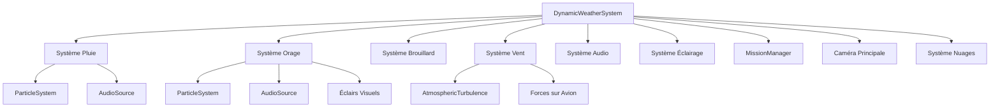
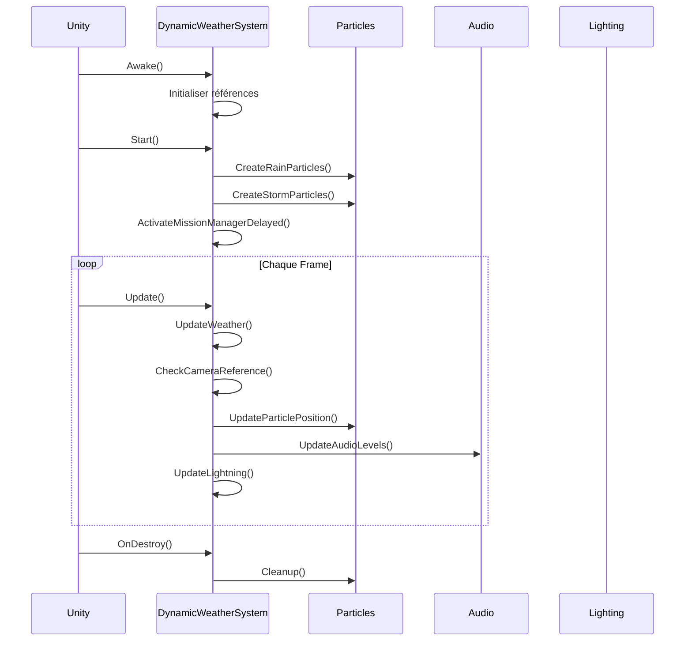
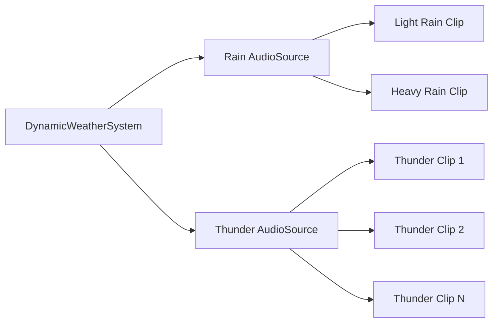

# Système Météorologique Dynamique - Documentation Technique

## Table des matières

1. [Vue d'ensemble](#vue-densemble)
2. [Architecture du système](#architecture-du-système)
3. [Composants météorologiques](#composants-météorologiques)
4. [Systèmes de particules](#systèmes-de-particules)
5. [Effets audio](#effets-audio)
6. [Effets visuels](#effets-visuels)
7. [Système de vent](#système-de-vent)
8. [Intégration avec les missions](#intégration-avec-les-missions)
9. [Performance et optimisation](#performance-et-optimisation)

## Vue d'ensemble

Le système météorologique dynamique (`DynamicWeatherSystem.cs`) offre un contrôle complet et en temps réel des conditions météorologiques dans le simulateur.

### Fonctionnalités principales

- Contrôle de l'intensité météo (0=beau, 1=tempête)
- Système de pluie avec particules
- Système d'orage avec éclairs
- Brouillard dynamique
- Vent avec turbulences
- Sons ambiants adaptatifs
- Éclairage dynamique

### Paramètres globaux

| Paramètre          | Type  | Plage       | Description                            |
| ------------------ | ----- | ----------- | -------------------------------------- |
| `weatherIntensity` | float | 0.0 - 1.0   | Intensité globale de la météo          |
| `windDirection`    | float | 0° - 360°   | Direction du vent (0=Nord)             |
| `fogDistance`      | float | 200 - 2000m | Distance de visibilité                 |
| `sunIntensity`     | float | 0.0 - 3.0   | Intensité de la lumière directionnelle |

## Architecture du système

### Diagramme de composants




### Cycle de vie



### Initialisation

```csharp
void Start()
{
    // Sauvegarder l'intensité originale du soleil
    if (sunLight != null)
    {
        originalSunIntensity = sunLight.intensity;
    }

    // Créer les systèmes de particules
    CreateRainParticles();
    CreateStormParticles();

    // Initialiser l'émission
    if (rainParticles != null)
    {
        rainEmission = rainParticles.emission;
    }

    // Activer le brouillard
    if (useFog)
    {
        RenderSettings.fog = true;
        RenderSettings.fogColor = fogColor;
        RenderSettings.fogMode = FogMode.Linear;
    }

    // Activer le MissionManager avec délai
    StartCoroutine(ActivateMissionManagerDelayed());

    // Mise à jour initiale
    UpdateWeather();
}
```

## Composants météorologiques

### Pluie

#### Configuration des particules

```csharp
void CreateRainParticles()
{
    if (rainParticles == null && mainCamera != null)
    {
        GameObject rainObj = new GameObject("RainParticles");
        rainParticles = rainObj.AddComponent<ParticleSystem>();

        // Position initiale
        rainParticles.transform.position = mainCamera.transform.position + Vector3.up * 50f;

        var main = rainParticles.main;
        main.simulationSpace = ParticleSystemSimulationSpace.World;
        main.startLifetime = 2f;
        main.startSpeed = 10f;
        main.startSize = 0.1f;
        main.startColor = new Color(0.7f, 0.7f, 0.8f, 0.5f);
        main.maxParticles = 1000;

        // Forme d'émission
        var shape = rainParticles.shape;
        shape.shapeType = ParticleSystemShapeType.Box;
        shape.scale = new Vector3(100f, 1f, 100f);

        // Gravité
        var velocityOverLifetime = rainParticles.velocityOverLifetime;
        velocityOverLifetime.enabled = true;
        velocityOverLifetime.y = -20f;

        // Émission
        var emission = rainParticles.emission;
        emission.rateOverTime = 0f;  // Contrôlé dynamiquement

        rainParticles.Play();
    }
}
```

**Paramètres clés**:
| Paramètre | Valeur | Justification |
|-----------|--------|---------------|
| `startLifetime` | 2s | Durée visible de la goutte |
| `startSpeed` | 10 m/s | Vitesse initiale vers le bas |
| `startSize` | 0.1 | Petite taille pour réalisme |
| `maxParticles` | 1000 | Équilibre performance/densité |
| `shape.scale` | 100x1x100 | Zone d'émission autour du joueur |
| `velocityOverLifetime.y` | -20 | Accélération gravitationnelle |

#### Suivi de la caméra

**Problème résolu**:
Les particules de pluie ne suivaient pas l'avion après le décollage.

**Solution**:

```csharp
void UpdateWeather()
{
    // Vérifier et mettre à jour la référence caméra
    if (mainCamera == null || !mainCamera.enabled)
    {
        mainCamera = Camera.main;
    }

    // Repositionner la pluie
    if (rainParticles != null && mainCamera != null)
    {
        rainParticles.transform.position = mainCamera.transform.position + Vector3.up * 50f;
    }

    // ... autres mises à jour
}
```

**Offset vertical (+50m)**:

- Les particules apparaissent au-dessus du joueur
- Temps de chute visible avant d'atteindre l'avion
- Évite les particules qui "pop" dans le champ de vision

#### Intensité de la pluie

```csharp
// Calcul de l'émission basé sur weatherIntensity
float emissionRate = Mathf.Lerp(0f, maxRainEmission, weatherIntensity);
rainEmission.rateOverTime = emissionRate;
```

**Tableau d'intensité**:
| weatherIntensity | Émission (particules/s) | Description |
|------------------|-------------------------|-------------|
| 0.0 | 0 | Pas de pluie |
| 0.2 | 100 | Pluie légère |
| 0.5 | 250 | Pluie modérée |
| 0.8 | 400 | Pluie forte |
| 1.0 | 500 | Pluie torrentielle |

**maxRainEmission**: Typiquement 500 particules/seconde

### Orage

#### Particules d'orage

```csharp
void CreateStormParticles()
{
    if (stormParticles == null && mainCamera != null)
    {
        GameObject stormObj = new GameObject("StormParticles");
        stormParticles = stormObj.AddComponent<ParticleSystem>();

        // Configuration similaire à la pluie mais avec:
        // - Particules plus grandes
        // - Vitesse plus élevée
        // - Émission sporadique

        var main = stormParticles.main;
        main.startSize = 0.3f;  // Plus gros que la pluie
        main.startSpeed = 15f;   // Plus rapide
        main.startColor = Color.white;  // Éclairs blancs
        main.maxParticles = 100;  // Moins de particules

        stormParticles.Stop();  // Démarré manuellement
    }
}
```

**Différences avec la pluie**:

- Particules plus visibles (blanches, plus grandes)
- Émission contrôlée manuellement
- Apparitions sporadiques synchronisées avec tonnerre

#### Système d'éclairs

**Configuration**:

```csharp
[Header("Éclairs")]
[Tooltip("Activer les éclairs visuels")]
public bool enableLightning = true;

[Tooltip("Intensité maximale de l'éclair")]
public float lightningIntensity = 3f;

[Tooltip("Durée de l'éclair (secondes)")]
public float lightningDuration = 0.1f;

private bool isLightningActive = false;
private float lightningTimer = 0f;
```

**Logique de déclenchement**:

```csharp
void Update()
{
    // Déclencher éclairs si orage actif
    if (weatherIntensity > 0.7f && enableLightning)
    {
        if (Time.time > nextThunderTime)
        {
            StartCoroutine(TriggerLightning());

            // Planifier prochain éclair
            float interval = Random.Range(minThunderInterval, maxThunderInterval);
            nextThunderTime = Time.time + interval;
        }
    }

    // Mettre à jour l'éclair actif
    if (isLightningActive)
    {
        lightningTimer += Time.deltaTime;

        if (lightningTimer >= lightningDuration)
        {
            // Retour à la normale
            if (sunLight != null)
            {
                sunLight.intensity = originalSunIntensity;
            }
            isLightningActive = false;
        }
    }
}
```

**Effet visuel de l'éclair**:

```csharp
IEnumerator TriggerLightning()
{
    isLightningActive = true;
    lightningTimer = 0f;

    // Augmenter brusquement l'intensité du soleil
    if (sunLight != null)
    {
        sunLight.intensity = originalSunIntensity * lightningIntensity;
    }

    // Jouer le son du tonnerre
    if (thunderAudioSource != null && thunderSounds.Length > 0)
    {
        AudioClip clip = thunderSounds[Random.Range(0, thunderSounds.Length)];
        thunderAudioSource.PlayOneShot(clip);
    }

    yield return new WaitForSeconds(lightningDuration);

    // Le retour à la normale est géré dans Update()
}
```

**Paramètres recommandés**:

- `lightningIntensity`: 3.0 (300% de l'intensité normale)
- `lightningDuration`: 0.1s (flash très court)
- `minThunderInterval`: 3s (minimum entre éclairs)
- `maxThunderInterval`: 10s (maximum entre éclairs)

#### Sons de tonnerre

**Configuration**:

```csharp
[Header("Effets Audio")]
[Tooltip("Source audio pour le tonnerre")]
public AudioSource thunderAudioSource;

[Tooltip("Clips audio de tonnerre")]
public AudioClip[] thunderSounds;

[Tooltip("Intervalle minimum entre les tonnerres (secondes)")]
public float minThunderInterval = 3f;

[Tooltip("Intervalle maximum entre les tonnerres (secondes)")]
public float maxThunderInterval = 10f;
```

**Sélection aléatoire**:

```csharp
if (thunderSounds.Length > 0)
{
    int index = Random.Range(0, thunderSounds.Length);
    AudioClip clip = thunderSounds[index];
    thunderAudioSource.PlayOneShot(clip);
}
```

**Recommandations**:

- Utiliser 3-5 variations de sons de tonnerre
- Durée des clips: 2-5 secondes
- Format: WAV ou OGG compressé
- Spatialisation: 3D avec atténuation basée sur distance

### Brouillard

#### Configuration Unity

```csharp
void Start()
{
    if (useFog)
    {
        RenderSettings.fog = true;
        RenderSettings.fogColor = fogColor;
        RenderSettings.fogMode = FogMode.Linear;
    }
}
```

#### Mise à jour dynamique

```csharp
void UpdateWeather()
{
    if (useFog)
    {
        // Interpoler la distance de brouillard
        float targetFogStart = Mathf.Lerp(minFogDistance, maxFogDistance, weatherIntensity);
        float targetFogEnd = targetFogStart + 500f;

        // Smooth transition
        RenderSettings.fogStartDistance = Mathf.Lerp(
            RenderSettings.fogStartDistance,
            targetFogStart,
            Time.deltaTime * 0.5f
        );

        RenderSettings.fogEndDistance = Mathf.Lerp(
            RenderSettings.fogEndDistance,
            targetFogEnd,
            Time.deltaTime * 0.5f
        );
    }
}
```

**Paramètres**:
| weatherIntensity | fogStart (m) | fogEnd (m) | Visibilité |
|------------------|--------------|------------|------------|
| 0.0 | 2000 | 2500 | Excellente |
| 0.3 | 1400 | 1900 | Bonne |
| 0.7 | 600 | 1100 | Réduite |
| 1.0 | 200 | 700 | Très réduite |

**Couleur du brouillard**:

```csharp
public Color fogColor = new Color(0.7f, 0.75f, 0.8f);  // Gris-bleu
```

### Éclairage dynamique

#### Ajustement du soleil

```csharp
void UpdateWeather()
{
    if (sunLight != null && !isLightningActive)
    {
        // Réduire l'intensité du soleil avec la météo
        float targetIntensity = Mathf.Lerp(
            originalSunIntensity,
            originalSunIntensity * 0.3f,
            weatherIntensity
        );

        sunLight.intensity = Mathf.Lerp(
            sunLight.intensity,
            targetIntensity,
            Time.deltaTime
        );

        // Ajuster la couleur (plus gris en tempête)
        Color targetColor = Color.Lerp(
            Color.white,
            new Color(0.6f, 0.6f, 0.7f),
            weatherIntensity
        );

        sunLight.color = Color.Lerp(
            sunLight.color,
            targetColor,
            Time.deltaTime
        );
    }
}
```

**Impact visuel**:

- Beau temps: Lumière blanche brillante
- Tempête: Lumière grise atténuée (30% de l'intensité)
- Transition douce pour éviter les changements brusques

## Systèmes de particules

### Optimisations

**Culling**:

```csharp
var main = particleSystem.main;
main.cullingMode = ParticleSystemCullingMode.Automatic;
```

**Max Particles**:

```csharp
// Pluie: 1000 particules
// Orage: 100 particules
// Total: ~1100 particules simultanées
```

**Simulation Space**:

```csharp
main.simulationSpace = ParticleSystemSimulationSpace.World;
```

Les particules sont dans l'espace monde, pas liées au parent.

### Performance

**Impact estimé**:
| Système | Particules | Impact FPS | Recommandation |
|---------|------------|------------|----------------|
| Pluie légère | ~200 | -2 FPS | OK |
| Pluie forte | ~500 | -5 FPS | OK |
| Orage | ~100 | -1 FPS | OK |
| Total max | ~600 | -6 FPS | Acceptable |

**Optimisations possibles**:

```csharp
// Réduire maxParticles selon performance
int maxParticles = QualitySettings.GetQualityLevel() > 2 ? 1000 : 500;

// Désactiver si hors vue
if (!mainCamera.enabled || mainCamera == null)
{
    rainParticles.Stop();
}
else
{
    rainParticles.Play();
}
```

## Effets audio

### Architecture audio



### AudioSource pluie

**Configuration**:

```csharp
[Header("Effets Audio")]
[Tooltip("Source audio pour le son de pluie")]
public AudioSource rainAudioSource;

[Tooltip("Clip audio de pluie légère")]
public AudioClip lightRainSound;

[Tooltip("Clip audio de pluie forte")]
public AudioClip heavyRainSound;
```

**Mise à jour volume**:

```csharp
void UpdateWeather()
{
    if (rainAudioSource != null)
    {
        // Volume basé sur weatherIntensity
        float targetVolume = Mathf.Lerp(0f, 1f, weatherIntensity);
        rainAudioSource.volume = Mathf.Lerp(
            rainAudioSource.volume,
            targetVolume,
            Time.deltaTime * 2f
        );

        // Changer le clip selon l'intensité
        if (weatherIntensity > 0.5f && rainAudioSource.clip != heavyRainSound)
        {
            rainAudioSource.clip = heavyRainSound;
            rainAudioSource.Play();
        }
        else if (weatherIntensity <= 0.5f && rainAudioSource.clip != lightRainSound)
        {
            rainAudioSource.clip = lightRainSound;
            rainAudioSource.Play();
        }
    }
}
```

**Paramètres AudioSource**:

```csharp
rainAudioSource.loop = true;
rainAudioSource.spatialBlend = 0f;  // 2D
rainAudioSource.volume = 0f;  // Démarrage à 0
rainAudioSource.playOnAwake = false;
```

### AudioSource tonnerre

**Configuration**:

```csharp
thunderAudioSource.loop = false;  // One-shot
thunderAudioSource.spatialBlend = 0.5f;  // Partiellement spatialisé
thunderAudioSource.minDistance = 100f;
thunderAudioSource.maxDistance = 2000f;
thunderAudioSource.rolloffMode = AudioRolloffMode.Linear;
```

**Déclenchement**:

```csharp
if (Time.time > nextThunderTime && weatherIntensity > 0.7f)
{
    // Jouer son aléatoire
    int index = Random.Range(0, thunderSounds.Length);
    thunderAudioSource.PlayOneShot(thunderSounds[index]);

    // Prochain tonnerre
    nextThunderTime = Time.time + Random.Range(minThunderInterval, maxThunderInterval);
}
```

## Effets visuels

### CloudMaster integration

**À vérifier**: Implémentation exacte du CloudMaster

**Interface supposée**:

```csharp
[Tooltip("CloudMaster pour ajuster les nuages")]
public CloudMaster cloudMaster;

void UpdateWeather()
{
    if (cloudMaster != null)
    {
        // Ajuster la densité des nuages
        cloudMaster.SetCloudDensity(weatherIntensity);

        // Ajuster la vitesse
        cloudMaster.SetCloudSpeed(weatherIntensity * 2f);
    }
}
```

### Nuages volumétriques

**Intégration**:

```csharp
[Tooltip("Rendu volumétrique des nuages (Ray Marching)")]
public VolumetricCloudsRenderer volumetricClouds;

void UpdateWeather()
{
    if (volumetricClouds != null && volumetricClouds.enabled)
    {
        // La densité est gérée automatiquement par VolumetricCloudsRenderer
        // via weatherIntensity
    }
}
```

Voir [RENDERING.md](./RENDERING.md) pour détails sur les nuages volumétriques.

## Système de vent

### Calcul des forces

```csharp
[Header("Vent")]
[Tooltip("Force du vent maximum (m/s)")]
public float maxWindForce = 20f;

[Tooltip("Direction du vent (degrés, 0=Nord)")]
[Range(0f, 360f)]
public float windDirection = 0f;

[Tooltip("Variation aléatoire du vent")]
public float windVariation = 5f;

[Tooltip("Fréquence de changement du vent (Hz)")]
public float windChangeFrequency = 0.5f;

private float currentWindForce = 0f;
private Vector3 currentWindDirection = Vector3.zero;
```

**Mise à jour du vent**:

```csharp
void UpdateWind()
{
    // Force basée sur weatherIntensity
    float targetWindForce = maxWindForce * weatherIntensity;
    currentWindForce = Mathf.Lerp(
        currentWindForce,
        targetWindForce,
        Time.deltaTime * windChangeFrequency
    );

    // Direction avec variation
    float angleVariation = Mathf.PerlinNoise(Time.time * 0.1f, 0f) * windVariation;
    float finalAngle = (windDirection + angleVariation) * Mathf.Deg2Rad;

    currentWindDirection = new Vector3(
        Mathf.Sin(finalAngle),
        0f,
        Mathf.Cos(finalAngle)
    ) * currentWindForce;
}
```

### Interface publique

```csharp
/// <summary>
/// Obtenir la force actuelle du vent
/// </summary>
public Vector3 GetWindForce()
{
    return currentWindDirection;
}

/// <summary>
/// Obtenir l'intensité du vent
/// </summary>
public float GetWindIntensity()
{
    return currentWindForce;
}
```

### Intégration avec AtmosphericTurbulence

**À vérifier**: Implémentation exacte de AtmosphericTurbulence.cs

**Utilisation supposée**:

```csharp
// Dans Plane.cs ou système de vol
void FixedUpdate()
{
    // Appliquer le vent
    Vector3 windForce = weatherSystem.GetWindForce();
    rigidbody.AddForce(windForce, ForceMode.Force);

    // Appliquer turbulences
    if (turbulenceSystem != null)
    {
        Vector3 turbulence = turbulenceSystem.GetTurbulence(weatherSystem.weatherIntensity);
        rigidbody.AddForce(turbulence, ForceMode.Acceleration);
    }
}
```

## Intégration avec les missions

### Activation du MissionManager

```csharp
IEnumerator ActivateMissionManagerDelayed()
{
    // Attendre fin de chargement
    yield return new WaitForEndOfFrame();
    yield return new WaitForSeconds(0.1f);

    int fromMainMenu = PlayerPrefs.GetInt("FromMainMenu", 0);

    if (fromMainMenu == 1)
    {
        // Effacer le flag
        PlayerPrefs.DeleteKey("FromMainMenu");
        PlayerPrefs.Save();

        // Vérifier mission sélectionnée
        int selectedMission = PlayerPrefs.GetInt("SelectedMission", -1);
        string selectedMissionName = PlayerPrefs.GetString("SelectedMissionName", "");

        if (selectedMission >= 0 && !string.IsNullOrEmpty(selectedMissionName))
        {
            // Activer le MissionManager
            if (missionManager != null)
            {
                missionManager.gameObject.SetActive(true);
            }
        }
    }
}
```

### Contrôle par MissionManager

**Interface publique**:

```csharp
/// <summary>
/// Définir l'intensité météo
/// </summary>
public void SetWeatherIntensity(float intensity)
{
    weatherIntensity = Mathf.Clamp01(intensity);
    UpdateWeather();
}

/// <summary>
/// Obtenir l'intensité météo actuelle
/// </summary>
public float GetWeatherIntensity()
{
    return weatherIntensity;
}

/// <summary>
/// Description textuelle de la météo
/// </summary>
public string GetWeatherDescription()
{
    if (weatherIntensity < 0.2f)
        return "Ciel clair";
    else if (weatherIntensity < 0.5f)
        return "Nuageux";
    else if (weatherIntensity < 0.8f)
        return "Pluvieux";
    else
        return "Orageux";
}
```

**Utilisation par MissionManager**:

```csharp
// Mission 3: Appliquer tempête
weatherSystem.SetWeatherIntensity(1.0f);

// Fin Mission 3: Retour beau temps
weatherSystem.SetWeatherIntensity(0.0f);
```

## Performance et optimisation

### Mesures de performance

**Coût estimé par composant**:
| Composant | CPU (ms) | GPU (ms) | Notes |
|-----------|----------|----------|-------|
| Particules pluie | 0.5 | 1.0 | Dépend du nombre |
| Particules orage | 0.1 | 0.2 | Émission sporadique |
| Brouillard | 0.1 | 0.5 | Shader de post-process |
| Audio | 0.2 | 0.0 | Décodage CPU |
| Mise à jour générale | 0.1 | 0.0 | Calculs légers |
| **Total** | **1.0** | **1.7** | Acceptable |

**À vérifier**: Mesures réelles via Unity Profiler

### Optimisations implémentées

**1. Vérification caméra conditionnelle**:

```csharp
if (mainCamera == null || !mainCamera.enabled)
{
    mainCamera = Camera.main;
}
```

Évite les appels `Camera.main` coûteux à chaque frame.

**2. Interpolation smooth**:

```csharp
float target = CalculateTarget();
current = Mathf.Lerp(current, target, Time.deltaTime * speed);
```

Évite les changements brusques et calculs excessifs.

**3. Arrêt des systèmes inactifs**:

```csharp
if (weatherIntensity < 0.1f)
{
    if (rainParticles.isPlaying)
        rainParticles.Stop();

    if (rainAudioSource.isPlaying)
        rainAudioSource.Stop();
}
```

### Optimisations possibles

**1. Object Pooling pour particules**:

```csharp
// Au lieu de créer/détruire
Pool<Particle> particlePool = new Pool<Particle>(100);
```

**2. LOD pour particules selon distance**:

```csharp
float distance = Vector3.Distance(mainCamera.transform.position, targetPoint);
int maxParticles = distance < 500f ? 1000 : 500;
```

**3. Désactivation basée sur qualité**:

```csharp
if (QualitySettings.GetQualityLevel() < 2)
{
    // Désactiver effets avancés
    stormParticles.gameObject.SetActive(false);
    enableLightning = false;
}
```

**4. Batching audio**:

```csharp
// Grouper les mises à jour audio
if (Time.frameCount % 5 == 0)  // Tous les 5 frames
{
    UpdateAudioLevels();
}
```

### Recommandations de paramétrage

**Configuration basse**:

```csharp
maxRainEmission = 300;
maxParticles = 500;
enableLightning = false;
useFog = false;
```

**Configuration moyenne**:

```csharp
maxRainEmission = 500;
maxParticles = 1000;
enableLightning = true;
useFog = true;
minFogDistance = 1000f;
```

**Configuration haute**:

```csharp
maxRainEmission = 1000;
maxParticles = 2000;
enableLightning = true;
useFog = true;
minFogDistance = 2000f;
// + Nuages volumétriques
```

## API de référence

### Méthodes publiques

```csharp
// Contrôle météo
public void SetWeatherIntensity(float intensity)
public float GetWeatherIntensity()
public string GetWeatherDescription()

// Contrôle vent
public Vector3 GetWindForce()
public float GetWindIntensity()

// Contrôle éclairage
public void SetTimeOfDay(float hour)  // À implémenter
public float GetTimeOfDay()  // À implémenter

// Effets
public void TriggerLightning()
public void PlayThunder()
```

### Événements (à implémenter)

```csharp
// Événements pour notifications
public event Action<float> OnWeatherIntensityChanged;
public event Action OnLightningTriggered;
public event Action OnThunderPlayed;

// Utilisation
weatherSystem.OnWeatherIntensityChanged += (intensity) => {
    Debug.Log($"Météo changée: {intensity}");
};
```

## Conclusion

Le système météorologique dynamique offre un contrôle complet et réactif des conditions atmosphériques. L'intégration avec le système de missions permet de créer des expériences immersives et variées.

**Forces du système**:

- Transitions fluides et réalistes
- Synchronisation audio-visuelle
- Performance acceptable
- Extensibilité

**Points à améliorer**:

- Système de temps/cycle jour-nuit complet
- Système d'événements pour notifications
- Optimisations avancées (pooling, LOD)
- Paramètres de qualité exposés
- Profiling et mesures de performance

---

_Document mis à jour: Décembre 2025_
