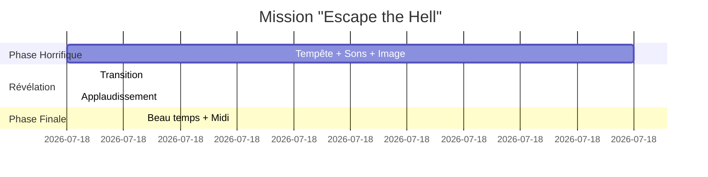

# Manuel Utilisateur - Tiny Flight Simulator

## Table des matières

1. [Introduction](#introduction)
2. [Installation](#installation)
3. [Démarrage](#démarrage)
4. [Contrôles](#contrôles)
5. [Interface utilisateur](#interface-utilisateur)
6. [Modes de jeu](#modes-de-jeu)
7. [Paramètres et personnalisation](#paramètres-et-personnalisation)
8. [Conseils et astuces](#conseils-et-astuces)
9. [Résolution de problèmes](#résolution-de-problèmes)

## Introduction

Bienvenue dans Tiny Flight Simulator, un simulateur de vol immersif offrant une expérience de pilotage réaliste dans un monde généré procéduralement.

### Caractéristiques principales

- Physique de vol réaliste avec décrochage et effets de sol
- Météo dynamique (pluie, orage, vent, brouillard)
- Deux modes de jeu: mission narrative et vol libre
- Génération procédurale de terrain et aéroports
- Graphismes avancés avec nuages volumétriques
- Contrôles souris/clavier intuitifs

### Contenu du package

```
tiny-flight-simulator-beta/
├── tiny-flight-simulator.exe     # Exécutable principal
├── tiny-flight-simulator_Data/   # Données du jeu
├── MonoBleedingEdge/             # Runtime Unity
├── UnityCrashHandler64.exe       # Gestionnaire de crash
└── UnityPlayer.dll               # Player Unity
```

## Installation

### Configuration système requise

**Minimale**:

- OS: Windows 10 64-bit
- Processeur: Intel Core i5-6600K / AMD Ryzen 5 1600
- Mémoire: 8 GB RAM
- Carte graphique: NVIDIA GTX 1060 / AMD RX 580
- DirectX: Version 11
- Espace disque: 2 GB

**Recommandée**:

- OS: Windows 11 64-bit
- Processeur: Intel Core i7-8700K / AMD Ryzen 7 2700X
- Mémoire: 16 GB RAM
- Carte graphique: NVIDIA RTX 2060 / AMD RX 5700 XT
- DirectX: Version 12
- Espace disque: 4 GB

### Procédure d'installation

1. **Télécharger le package**

   ```
   Extraire tiny-flight-simulator-beta.zip
   dans un dossier de votre choix
   ```

2. **Vérifier l'intégrité**
   - Tous les fichiers doivent être présents
   - Taille totale: environ 500 MB

3. **Lancer le jeu**
   - Double-cliquer sur `tiny-flight-simulator.exe`
   - Accepter les permissions Windows si demandé

**Note**: Aucune installation supplémentaire n'est requise. Le jeu est portable.

## Démarrage


### Menu principal


Le menu principal offre les options suivantes:

| Bouton         | Description                                   |
| -------------- | --------------------------------------------- |
| **Start Game** | Démarrer une nouvelle session                 |
| **Settings**   | Configurer les paramètres (audio, graphiques) |
| **Credits**    | Afficher les crédits                          |
| **Quit**       | Quitter l'application                         |

### Sélection de mission


1. **Escape the Hell**
   - Mission narrative avec atmosphère horrifique
   - Conditions météo verrouillées (orage, minuit)
   - Durée: 10 minutes avant révélation
   - Difficulté: Élevée

2. **Free Ride**
   - Vol libre sans contraintes
   - Paramètres entièrement ajustables
   - Exploration du monde procédural
   - Difficulté: Aucune

**Sélection**:

1. Cliquer sur la mission désirée
2. Le panneau de sélection d'avion s'affiche
3. Choisir un avion et une couleur
4. Cliquer sur "Start Game"

### Sélection d'avion


**Options**:

- Choix parmi plusieurs modèles d'avion
- Sélection de la couleur (palette de 8 couleurs)
- Prévisualisation 3D du modèle


## Contrôles

### Contrôles de vol

#### Clavier et souris (par défaut)

| Commande   | Action                              |
| ---------- | ----------------------------------- |
| **Souris** | Contrôle de l'assiette (pitch/roll) |
| **W**      | Augmenter la puissance moteur       |
| **S**      | Réduire la puissance moteur         |
| **A**      | Lacet gauche (yaw left)             |
| **D**      | Lacet droite (yaw right)            |
| **Q**      | Roulis gauche (roll left)           |
| **E**      | Roulis droite (roll right)          |
| **Espace** | Frein aérien                        |
| **V**      | Changer de vue caméra               |


#### Sensibilité de la souris

La souris contrôle directement l'assiette de l'avion:

- **Axe vertical**: Pitch (cabrer/piquer)
- **Axe horizontal**: Roll (roulis)

**Astuce**: Mouvements doux pour éviter le sur-contrôle

#### Gestion de la puissance

**Décollage**:

1. Puissance à 100% (maintenir W)
2. Vitesse minimale: 30-35 km/h
3. Tirer doucement vers l'arrière (souris vers le bas)
4. Maintenir l'angle de montée stable

**Croisière**:

- Puissance: 60-80%
- Altitude recommandée: 500-1000m
- Assiette horizontale

**Atterrissage**:

1. Réduire la puissance progressivement
2. Approche à 40-50 km/h
3. Descente douce (2-3° vers le bas)
4. Arrondir juste avant le contact
5. Couper les gaz au toucher des roues


### Contrôles de caméra

| Touche               | Mode      | Description                     |
| -------------------- | --------- | ------------------------------- |
| **V**                | Toggle    | Basculer cockpit ↔ externe      |
| **Souris** (cockpit) | Free Look | Regarder autour dans le cockpit |

**Mode Cockpit**:

- Vue immersive depuis le poste de pilotage
- Free look activé automatiquement
- Instruments visibles (speedomètre, altimètre)


**Mode Externe**:

- Vue en suivant l'avion
- Caméra centrée sur l'avion
- Idéal pour observer l'environnement


### Contrôles de menu

| Touche    | Action                            |
| --------- | --------------------------------- |
| **Échap** | Ouvrir/fermer le menu in-game     |
| **M**     | Afficher la carte (si disponible) |
| **F**     | Afficher les FPS                  |

## Interface utilisateur

### HUD (Head-Up Display)


**Éléments affichés**:

1. **Vitesse** - Vitesse actuelle en km/h
2. **Altitude** - Altitude en mètres
3. **Indicateur d'horizon** - Assiette de l'avion
4. **Puissance moteur** - Pourcentage de puissance
5. **Météo** - Conditions actuelles
6. **Position** - Coordonnées (si activé)


### Menu in-game

Accessible avec **Échap**


**Options disponibles**:

#### Onglet Météo

| Contrôle           | Fonction                  | Plage                  |
| ------------------ | ------------------------- | ---------------------- |
| **Weather Slider** | Ajuster l'intensité météo | 0 (beau) - 1 (tempête) |
| **Time Slider**    | Ajuster l'heure           | 0h - 24h               |

**Effet des paramètres**:

- **Météo 0.0**: Ciel clair, pas de vent
- **Météo 0.5**: Nuages, vent modéré
- **Météo 1.0**: Tempête, pluie, éclairs, vent fort

**Note**: En mission "Escape the Hell", ces contrôles sont verrouillés pendant 10 minutes.

#### Onglet Contrôles

- **Toggle View** - Changer de vue caméra
- **Resume** - Reprendre le jeu
- **Return to Menu** - Retour au menu principal
- **Quit** - Quitter l'application

### Indicateurs visuels

**Décrochage (Stall)**:

- Écran qui vibre
- Son d'alarme (si implémenté)
- Perte de contrôle de l'assiette

**Collision imminente**:

- **À vérifier**: Système d'alerte implémenté ou non

**Événements Mission 3**:

- Sons d'horreur aléatoires
- Image effrayante défilant sur l'écran
- Conditions météo extrêmes

## Modes de jeu

### Mode "Escape the Hell"


**Synopsis**:
Mission narrative où le joueur doit piloter dans des conditions extrêmes pendant 10 minutes avant la "révélation".

**Conditions initiales**:

- Heure: Minuit (24h)
- Météo: Tempête maximale (intensité 1.0)
- Contrôles météo: Verrouillés
- Atmosphère: Horrifique

**Effets spéciaux**:

1. **Sons d'horreur**
   - 2 sons différents joués aléatoirement
   - Intervalle: 30-60 secondes
   - Volume configurable

2. **Image effrayante**
   - Défile sur l'écran depuis 4 directions possibles
   - Intervalle: 10-120 secondes
   - Vitesse: 500 pixels/seconde

3. **Conditions météo**
   - Pluie intense
   - Éclairs fréquents
   - Vent violent avec turbulences
   - Visibilité réduite

**Vidéo**: `mission_escape_hell_complete.mp4` - Mission complète (12 minutes)

#### Timeline de la mission



**Déroulement**:

| Temps      | Événement        | Description                   |
| ---------- | ---------------- | ----------------------------- |
| 0:00       | Début            | Spawn dans la tempête, minuit |
| 0:00-10:00 | Phase horrifique | Sons + image + météo extrême  |
| 10:00      | Fin des effets   | Arrêt des sons et de l'image  |
| 10:00      | Transition météo | Météo passe à 0 (beau temps)  |
| 10:00      | Transition heure | Heure passe à 12h (midi)      |
| 10:01      | Applaudissement  | Son de félicitation           |
| 10:01+     | Vol libre        | Contrôles déverrouillés       |

**Philosophie**:
La mission représente une épreuve psychologique où le joueur doit maintenir son calme face à des conditions extrêmes. La "révélation" après 10 minutes symbolise la récompense de la persévérance.

**Conseils de survie**:

- Maintenir une altitude stable (500-800m)
- Ne pas sur-corriger lors des turbulences
- Ignorer les distractions visuelles et sonores
- Se concentrer sur les instruments de vol


### Mode "Free Ride"


**Description**:
Mode sandbox permettant l'exploration libre du monde procédural sans contraintes ni objectifs.

**Caractéristiques**:

- Contrôle complet de la météo
- Ajustement libre de l'heure
- Aucune limite de temps
- Aucun effet horrifique
- Monde entièrement explorable

**Utilisations recommandées**:

- Apprentissage des contrôles de vol
- Exploration de la génération procédurale
- Tests de conditions météo
- Vol de détente


#### Réglages météo

**Intensité 0.0 - Beau temps**:

- Ciel dégagé
- Vent nul
- Visibilité maximale
- Idéal pour débutants

**Intensité 0.3 - Nuages**:

- Quelques nuages
- Vent léger (5-10 km/h)
- Turbulences faibles

**Intensité 0.7 - Mauvais temps**:

- Nuages denses
- Pluie modérée
- Vent moyen (15-25 km/h)
- Turbulences moyennes

**Intensité 1.0 - Tempête**:

- Orage complet
- Pluie torrentielle
- Vent fort (30+ km/h)
- Turbulences élevées
- Éclairs fréquents

**Tableau des effets**:

| Intensité | Pluie        | Vent (km/h) | Visibilité   | Turbulences  | Éclairs        |
| --------- | ------------ | ----------- | ------------ | ------------ | -------------- |
| 0.0       | Aucune       | 0           | Excellente   | Nulles       | Non            |
| 0.2       | Légère       | 5           | Très bonne   | Faibles      | Non            |
| 0.5       | Modérée      | 15          | Bonne        | Moyennes     | Rares          |
| 0.8       | Forte        | 25          | Réduite      | Élevées      | Fréquents      |
| 1.0       | Torrentielle | 35+         | Très réduite | Très élevées | Très fréquents |

#### Réglages temporels

**Cycle jour/nuit**:

- **0h-6h**: Nuit profonde
- **6h-8h**: Aube
- **8h-18h**: Jour
- **18h-20h**: Crépuscule
- **20h-24h**: Nuit

**Effets de l'heure**:

- Éclairage dynamique
- Couleur du ciel
- Intensité des ombres
- Température de couleur

**À compléter**: Effets précis de chaque heure

## Paramètres et personnalisation

### Options graphiques

**À compléter**: Détails des options graphiques disponibles

Paramètres typiques:

- Qualité des textures
- Distance de vue
- Anti-aliasing
- Post-processing
- Ombres
- VSync

### Options audio

**Volumes ajustables**:

- Volume général
- Musique
- Effets sonores
- Ambiance (vent, pluie)

**À compléter**: Interface des options audio

### Personnalisation de l'avion

**Couleurs disponibles**:
Palette de 8 couleurs pour chaque avion:

1. Blanc
2. Noir
3. Rouge
4. Bleu
5. Vert
6. Jaune
7. Orange
8. Violet

**Sauvegarde**:
La couleur sélectionnée est sauvegardée et appliquée automatiquement lors du lancement depuis le menu principal.

## Conseils et astuces

### Pour débutants

**Premiers pas**:

1. Commencer en mode "Free Ride"
2. Régler la météo sur 0.0 (beau temps)
3. S'entraîner au décollage et atterrissage
4. Pratiquer les virages coordonnés

**Décollage sûr**:

```
1. Aligner l'avion sur la piste
2. Puissance à 100% (maintenir W)
3. Garder les ailes horizontales (souris centrée)
4. À 30-35 km/h, tirer doucement sur la souris
5. Maintenir une montée à 10-15° maximum
6. Réduire la puissance à 70-80% une fois stable
```

**Atterrissage sûr**:

```
1. Approcher à 500m d'altitude
2. Réduire la puissance progressivement
3. Descendre à 2-3° vers le bas
4. Maintenir 40-50 km/h
5. Arrondir 5-10m au-dessus de la piste
6. Couper les gaz au toucher des roues
7. Laisser l'avion rouler
```


### Vol avancé

**Gestion du décrochage**:

- Apparaît si l'angle d'attaque est trop élevé
- Reconnaissable à la perte de contrôle
- **Récupération**:
  1. Pousser le manche (souris vers le haut)
  2. Puissance à 100%
  3. Garder les ailes horizontales
  4. Reprendre de la vitesse avant de redresser

**Vol dans la tempête**:

- Maintenir une puissance élevée (80-90%)
- Ne pas sur-corriger les turbulences
- Privilégier l'altitude (plus stable au-dessus de 800m)
- Surveiller constamment la vitesse

**Virages serrés**:

- Incliner à 30-45° maximum
- Augmenter légèrement la puissance
- Tirer doucement sur la souris pour maintenir l'altitude
- Coordonner avec le lacet (A/D)

**Navigation**:

- Utiliser les aéroports comme points de repère
- Se repérer par rapport au soleil (est le matin, ouest le soir)
- Altitude de sécurité: toujours au-dessus de 300m

### Optimisation des performances

**Si le jeu rame**:

1. Réduire la qualité graphique
2. Désactiver les nuages volumétriques
3. Réduire la distance de vue
4. Désactiver le post-processing
5. Fermer les autres applications

**Améliorer la fluidité**:

- Activer VSync pour limiter à 60 FPS
- Mettre à jour les drivers graphiques
- Jouer en mode plein écran
- Désactiver l'enregistrement Windows Game Bar

## Résolution de problèmes

### Problèmes courants

#### Le jeu ne démarre pas

**Solutions**:

1. Vérifier la configuration système minimale
2. Mettre à jour les drivers graphiques
3. Installer DirectX Runtime
4. Exécuter en tant qu'administrateur
5. Désactiver l'antivirus temporairement
6. Vérifier l'intégrité des fichiers

#### L'avion spawne à l'envers

**Cause**: Bug connu (rare)

**Solution**:

1. Retourner au menu principal (Échap → Return to Menu)
2. Relancer la mission
3. Si le problème persiste, relancer l'application

#### Les contrôles ne répondent pas

**Solutions**:

1. Vérifier que le jeu a le focus (cliquer dans la fenêtre)
2. Débrancher les contrôleurs USB non utilisés
3. Redémarrer le jeu
4. Vérifier les paramètres de sensibilité

#### Performance faible

**Diagnostic**:

- Appuyer sur F pour afficher les FPS
- Objectif: 30 FPS minimum, 60 FPS idéal

**Solutions**:

1. Réduire les paramètres graphiques
2. Réduire la résolution
3. Désactiver les nuages volumétriques
4. Fermer les applications en arrière-plan
5. Nettoyer les pilotes avec DDU et réinstaller

#### La pluie ne suit pas l'avion

**Cause**: Bug corrigé dans la version actuelle

**Solution**:

- Vérifier que vous avez la dernière version
- Si le problème persiste, redémarrer la scène

#### Les sons sont décalés ou absents

**Solutions**:

1. Vérifier le volume général dans les options
2. Vérifier le volume système Windows
3. Tester avec différents périphériques audio
4. Redémarrer le jeu

### Fichiers de log

**Emplacement des logs**:

```
%APPDATA%\..\LocalLow\[CompanyName]\tiny-flight-simulator-beta\Player.log
```

**Utilisation**:

- Ouvrir avec un éditeur de texte
- Rechercher les lignes contenant "Error" ou "Exception"
- Fournir le log lors du rapport de bug

### Rapporter un bug

**Informations à fournir**:

1. Description détaillée du problème
2. Étapes de reproduction
3. Configuration système (CPU, GPU, RAM, OS)
4. Fichier Player.log
5. Captures d'écran ou vidéo si possible

**Format de rapport**:

```
Titre: [Bug] Description courte

Description:
Description détaillée du problème

Étapes de reproduction:
1. Étape 1
2. Étape 2
3. ...

Résultat attendu:
Ce qui devrait se passer

Résultat actuel:
Ce qui se passe réellement

Système:
- OS: Windows 10/11
- CPU:
- GPU:
- RAM:

Fichiers joints:
- Player.log
- screenshot.png
```

## Annexes

### Raccourcis clavier complets

| Touche | Action              | Contexte            |
| ------ | ------------------- | ------------------- |
| W      | Augmenter puissance | Vol                 |
| S      | Réduire puissance   | Vol                 |
| A      | Lacet gauche        | Vol                 |
| D      | Lacet droite        | Vol                 |
| Q      | Roulis gauche       | Vol                 |
| E      | Roulis droite       | Vol                 |
| Espace | Frein aérien        | Vol                 |
| V      | Changer vue         | Vol                 |
| Échap  | Menu in-game        | Vol                 |
| M      | Carte               | Vol (si disponible) |
| F      | FPS                 | Partout             |
| F11    | Plein écran         | Partout             |

### Glossaire aéronautique

| Terme               | Définition                                      |
| ------------------- | ----------------------------------------------- |
| **Pitch**           | Mouvement de tangage (nez haut/bas)             |
| **Roll**            | Mouvement de roulis (inclinaison latérale)      |
| **Yaw**             | Mouvement de lacet (rotation horizontale)       |
| **Stall**           | Décrochage - perte de portance                  |
| **Angle of Attack** | Angle entre l'aile et le flux d'air             |
| **Ground Effect**   | Effet de sol - portance accrue près du sol      |
| **Turbulence**      | Mouvements d'air irréguliers                    |
| **Drag**            | Traînée - résistance de l'air                   |
| **Lift**            | Portance - force qui maintient l'avion en l'air |
| **Airspeed**        | Vitesse de l'air relatif à l'avion              |


---

_Manuel utilisateur - Version Beta 0.9 - Décembre 2025_
